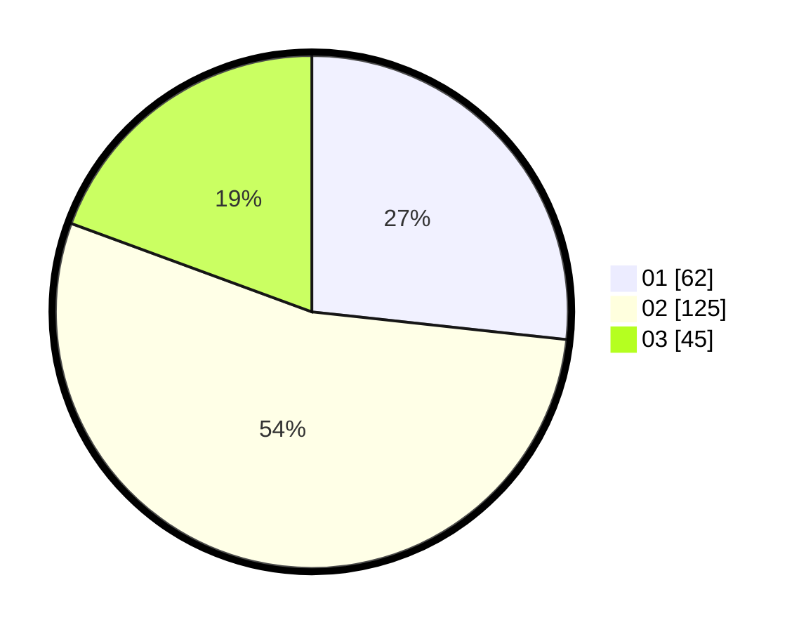

# Hasil

Hasil perolehan suara paslon dapat dilihat pada file paslon-01.txt, paslon-02.txt, dan paslon-03.txt.

Jika tidak ada, artinya data tersebut belum ada pada SIREKAP.

## Perolehan Suara

 * Paslon 01: **62**.
 * Paslon 02: **125**.
 * Paslon 03: **45**.

## Foto C Plano

https://sirekap-obj-formc.kpu.go.id/bc13/pemilu/ppwp/31/73/01/10/04/3173011004030-20240216-020736--b9a6bd43-3235-4b61-a1ce-618510df9cd4.jpg

https://sirekap-obj-formc.kpu.go.id/bc13/pemilu/ppwp/31/73/01/10/04/3173011004030-20240216-020737--defd5fc6-756e-4b67-a0f0-7161392674cc.jpg

https://sirekap-obj-formc.kpu.go.id/bc13/pemilu/ppwp/31/73/01/10/04/3173011004030-20240216-015012--b47c231c-4221-4b13-a534-590e583f1c51.jpg

## DATA PEMILIH TETAP

Jumlah pemilih dalam DPT: **296**.
 * L: **144**.
 * P: **152**.

## DATA PENGGUNA HAK PILIH

Jumlah pengguna hak pilih dalam DPT: **232**.
 * L: **109**.
 * P: **123**.

Jumlah pengguna hak pilih dalam DPTb: **1**.
 * L: **1**.
 * P: **0**.

Jumlah pengguna hak pilih dalam DPK: **0**.
 * L: **0**.
 * P: **0**.

Jumlah pengguna hak pilih: **233**.
 * L: **110**.
 * P: **123**.

## JUMLAH SUARA SAH DAN TIDAK SAH

JUMLAH SELURUH SUARA SAH: **232**.

JUMLAH SUARA TIDAK SAH: **1**.

JUMLAH SELURUH SUARA SAH DAN SUARA TIDAK SAH: **233**.
