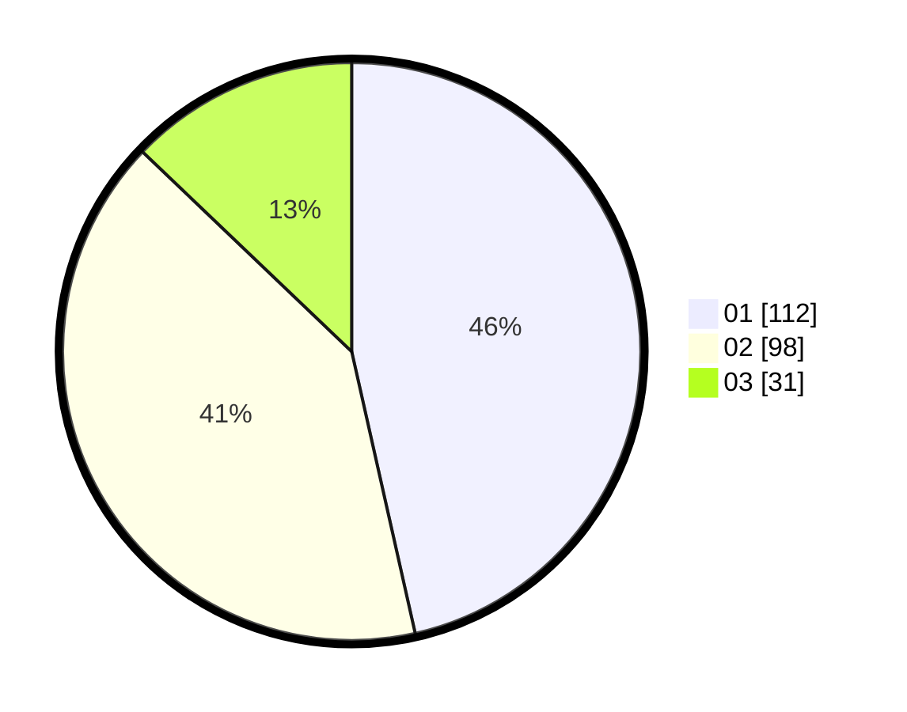

# Hasil

Hasil perolehan suara paslon dapat dilihat pada file paslon-01.txt, paslon-02.txt, dan paslon-03.txt.

Jika tidak ada, artinya data tersebut belum ada pada SIREKAP.

## Perolehan Suara

 * Paslon 01: **112**.
 * Paslon 02: **98**.
 * Paslon 03: **31**.

## Foto C Plano

https://sirekap-obj-formc.kpu.go.id/96ff/pemilu/ppwp/31/73/01/10/04/3173011004034-20240215-021550--8e16d62a-e7ff-4c51-b513-eace159809c3.jpg

https://sirekap-obj-formc.kpu.go.id/96ff/pemilu/ppwp/31/73/01/10/04/3173011004034-20240215-034804--fcc84f29-846c-4317-b993-936ed959ca47.jpg

https://sirekap-obj-formc.kpu.go.id/96ff/pemilu/ppwp/31/73/01/10/04/3173011004034-20240215-021806--266d0bb5-8f5e-4678-9404-7b20aca8274f.jpg
