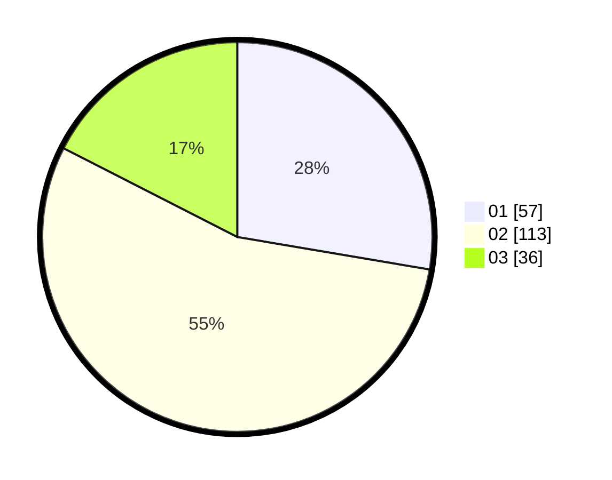

# Hasil

Hasil perolehan suara paslon dapat dilihat pada file paslon-01.txt, paslon-02.txt, dan paslon-03.txt.

Jika tidak ada, artinya data tersebut belum ada pada SIREKAP.

## Perolehan Suara

 * Paslon 01: **57**.
 * Paslon 02: **113**.
 * Paslon 03: **36**.

## Foto C Plano

https://sirekap-obj-formc.kpu.go.id/c743/pemilu/ppwp/31/73/01/10/04/3173011004035-20240215-004205--ac17d863-bac0-4898-80ae-4e7bcc1823d2.jpg

https://sirekap-obj-formc.kpu.go.id/c743/pemilu/ppwp/31/73/01/10/04/3173011004035-20240214-234539--446e54cb-edab-4e56-9099-5fa19d94968b.jpg

https://sirekap-obj-formc.kpu.go.id/c743/pemilu/ppwp/31/73/01/10/04/3173011004035-20240215-004535--3bc8549d-19c9-4c1b-b015-55bd711e853f.jpg
