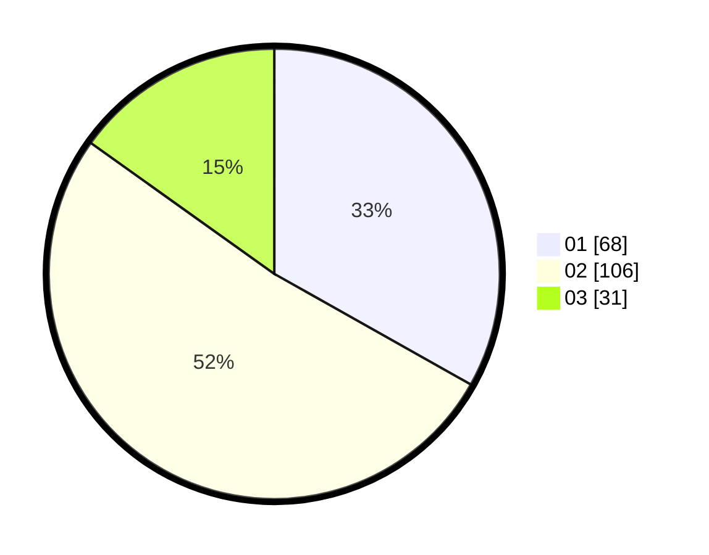

# Hasil

Hasil perolehan suara paslon dapat dilihat pada file paslon-01.txt, paslon-02.txt, dan paslon-03.txt.

Jika tidak ada, artinya data tersebut belum ada pada SIREKAP.

## Perolehan Suara

 * Paslon 01: **68**.
 * Paslon 02: **106**.
 * Paslon 03: **31**.

## Foto C Plano

https://sirekap-obj-formc.kpu.go.id/093d/pemilu/ppwp/31/73/01/10/04/3173011004037-20240214-205227--2ea71128-f64c-402e-a571-d194dddf69bf.jpg

https://sirekap-obj-formc.kpu.go.id/093d/pemilu/ppwp/31/73/01/10/04/3173011004037-20240214-194334--85e40b57-74e7-408c-a2b0-e2f3a9d4ff13.jpg

https://sirekap-obj-formc.kpu.go.id/093d/pemilu/ppwp/31/73/01/10/04/3173011004037-20240214-194413--b20cc99b-d0bd-492d-b5a3-557ca7e780a3.jpg

## DATA PEMILIH TETAP

Jumlah pemilih dalam DPT: **288**.
 * L: **144**.
 * P: **144**.

## DATA PENGGUNA HAK PILIH

Jumlah pengguna hak pilih dalam DPT: **210**.
 * L: **98**.
 * P: **112**.

Jumlah pengguna hak pilih dalam DPTb: **0**.
 * L: **0**.
 * P: **0**.

Jumlah pengguna hak pilih dalam DPK: **0**.
 * L: **0**.
 * P: **0**.

Jumlah pengguna hak pilih: **210**.
 * L: **98**.
 * P: **112**.

## JUMLAH SUARA SAH DAN TIDAK SAH

JUMLAH SELURUH SUARA SAH: **205**.

JUMLAH SUARA TIDAK SAH: **5**.

JUMLAH SELURUH SUARA SAH DAN SUARA TIDAK SAH: **210**.
