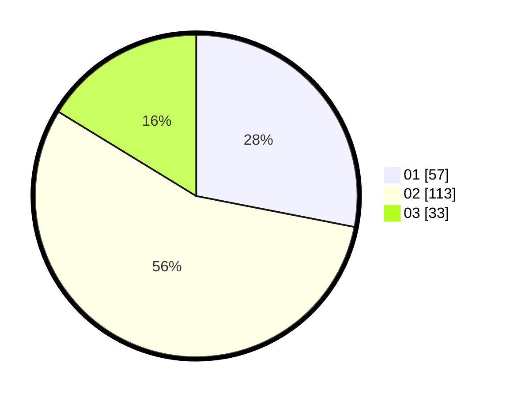

# Hasil

Hasil perolehan suara paslon dapat dilihat pada file paslon-01.txt, paslon-02.txt, dan paslon-03.txt.

Jika tidak ada, artinya data tersebut belum ada pada SIREKAP.

## Perolehan Suara

 * Paslon 01: **57**.
 * Paslon 02: **113**.
 * Paslon 03: **33**.

## Foto C Plano

https://sirekap-obj-formc.kpu.go.id/a33d/pemilu/ppwp/31/73/01/10/04/3173011004041-20240214-155047--9c8ce518-fab5-443b-a604-d8c81bf77c5a.jpg

https://sirekap-obj-formc.kpu.go.id/a33d/pemilu/ppwp/31/73/01/10/04/3173011004041-20240215-080732--b6a7333d-257d-4609-82b1-09fac810450f.jpg

https://sirekap-obj-formc.kpu.go.id/a33d/pemilu/ppwp/31/73/01/10/04/3173011004041-20240215-080721--38e9fa08-c128-477c-9e3e-4a0f18263e0a.jpg

## DATA PEMILIH TETAP

Jumlah pemilih dalam DPT: **268**.
 * L: **136**.
 * P: **132**.

## DATA PENGGUNA HAK PILIH

Jumlah pengguna hak pilih dalam DPT: **204**.
 * L: **99**.
 * P: **105**.

Jumlah pengguna hak pilih dalam DPTb: **1**.
 * L: **1**.
 * P: **0**.

Jumlah pengguna hak pilih dalam DPK: **3**.
 * L: **2**.
 * P: **1**.

Jumlah pengguna hak pilih: **208**.
 * L: **102**.
 * P: **106**.

## JUMLAH SUARA SAH DAN TIDAK SAH

JUMLAH SELURUH SUARA SAH: **203**.

JUMLAH SUARA TIDAK SAH: **5**.

JUMLAH SELURUH SUARA SAH DAN SUARA TIDAK SAH: **208**.
