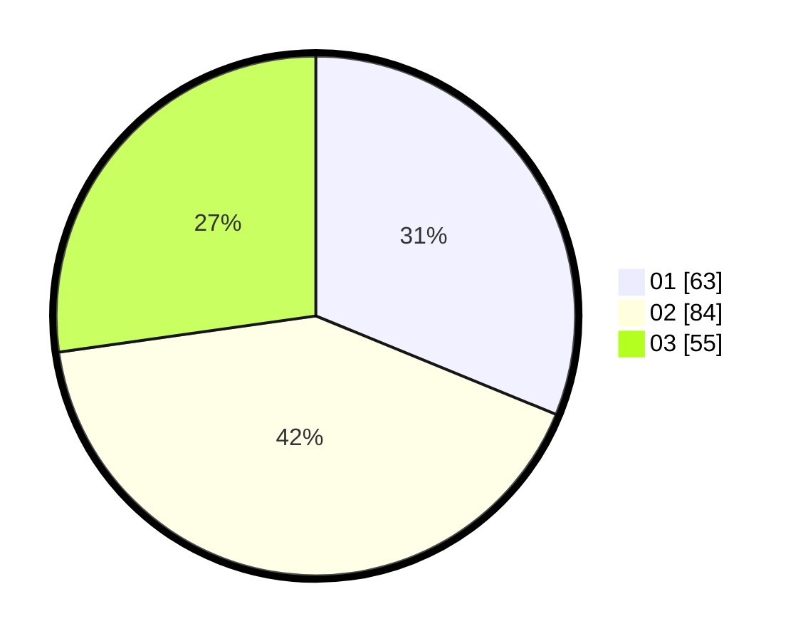

# Hasil

Hasil perolehan suara paslon dapat dilihat pada file paslon-01.txt, paslon-02.txt, dan paslon-03.txt.

Jika tidak ada, artinya data tersebut belum ada pada SIREKAP.

## Perolehan Suara

 * Paslon 01: **63**.
 * Paslon 02: **84**.
 * Paslon 03: **55**.

## Foto C Plano

https://sirekap-obj-formc.kpu.go.id/34b1/pemilu/ppwp/31/73/01/10/04/3173011004042-20240216-065717--0233408a-2d60-4907-9de8-b6027108c062.jpg

https://sirekap-obj-formc.kpu.go.id/34b1/pemilu/ppwp/31/73/01/10/04/3173011004042-20240216-065728--6aba3eff-f4e1-4bdb-ac5f-8e31ff55cc2e.jpg

https://sirekap-obj-formc.kpu.go.id/34b1/pemilu/ppwp/31/73/01/10/04/3173011004042-20240216-065726--7a3590a2-8beb-4cf7-980f-e2bb7a32cc7e.jpg

## DATA PEMILIH TETAP

Jumlah pemilih dalam DPT: **256**.
 * L: **127**.
 * P: **129**.

## DATA PENGGUNA HAK PILIH

Jumlah pengguna hak pilih dalam DPT: **203**.
 * L: **103**.
 * P: **100**.

Jumlah pengguna hak pilih dalam DPTb: **0**.
 * L: **0**.
 * P: **0**.

Jumlah pengguna hak pilih dalam DPK: **0**.
 * L: **0**.
 * P: **0**.

Jumlah pengguna hak pilih: **203**.
 * L: **103**.
 * P: **100**.

## JUMLAH SUARA SAH DAN TIDAK SAH

JUMLAH SELURUH SUARA SAH: **202**.

JUMLAH SUARA TIDAK SAH: **1**.

JUMLAH SELURUH SUARA SAH DAN SUARA TIDAK SAH: **203**.
