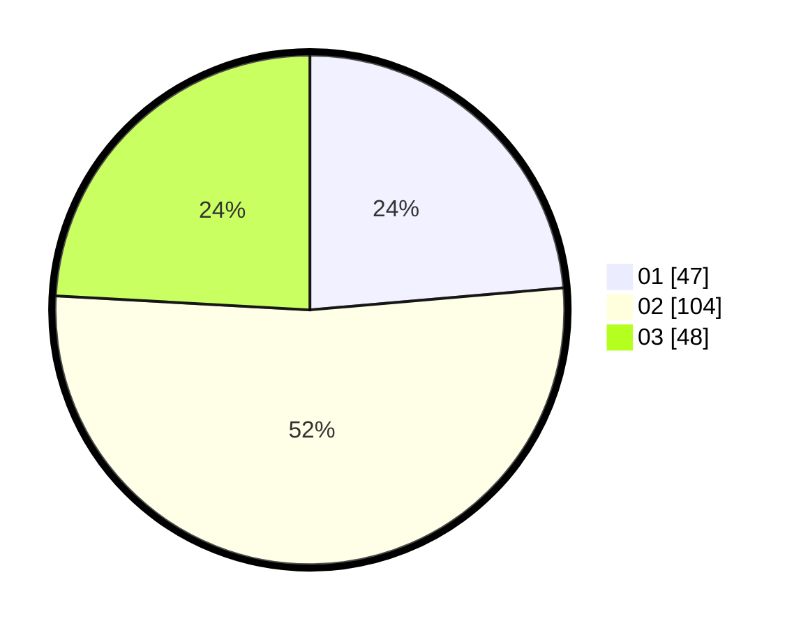

# Hasil

Hasil perolehan suara paslon dapat dilihat pada file paslon-01.txt, paslon-02.txt, dan paslon-03.txt.

Jika tidak ada, artinya data tersebut belum ada pada SIREKAP.

## Perolehan Suara

 * Paslon 01: **47**.
 * Paslon 02: **104**.
 * Paslon 03: **48**.

## Foto C Plano

https://sirekap-obj-formc.kpu.go.id/653b/pemilu/ppwp/31/73/01/10/04/3173011004045-20240215-124637--f03b4c00-f072-4c27-84eb-50b04e8ab3cc.jpg

https://sirekap-obj-formc.kpu.go.id/653b/pemilu/ppwp/31/73/01/10/04/3173011004045-20240215-124923--eccff1c6-1e6c-4e37-85da-b25222515999.jpg

https://sirekap-obj-formc.kpu.go.id/653b/pemilu/ppwp/31/73/01/10/04/3173011004045-20240215-125130--7b5fe3fe-d885-46d2-a1d6-5b8ed42b66ea.jpg
