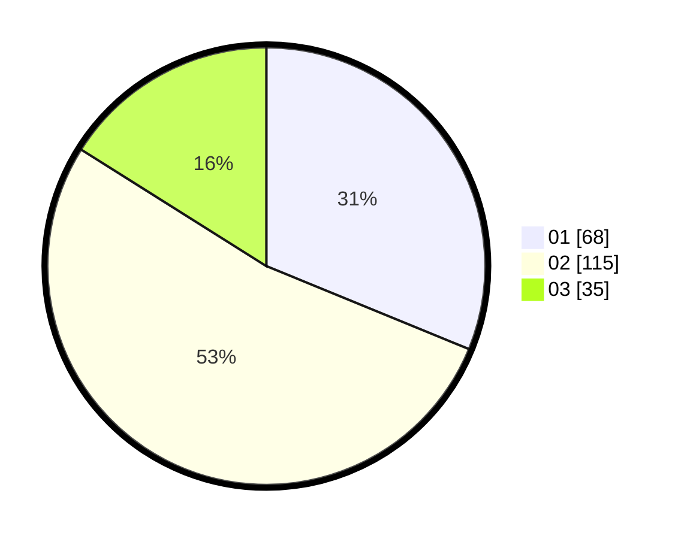

# Hasil

Hasil perolehan suara paslon dapat dilihat pada file paslon-01.txt, paslon-02.txt, dan paslon-03.txt.

Jika tidak ada, artinya data tersebut belum ada pada SIREKAP.

## Perolehan Suara

 * Paslon 01: **68**.
 * Paslon 02: **115**.
 * Paslon 03: **35**.

## Foto C Plano

https://sirekap-obj-formc.kpu.go.id/1f8f/pemilu/ppwp/31/73/01/10/04/3173011004048-20240214-233124--a2179d6e-42d4-4b5a-95b6-0fd62ff1ff4e.jpg

https://sirekap-obj-formc.kpu.go.id/1f8f/pemilu/ppwp/31/73/01/10/04/3173011004048-20240214-233321--58a17352-8fa2-43a4-a30e-e82e5860b02c.jpg

https://sirekap-obj-formc.kpu.go.id/1f8f/pemilu/ppwp/31/73/01/10/04/3173011004048-20240214-233455--2f5f79bc-8ae2-44fe-9509-6b50f4000bfd.jpg
