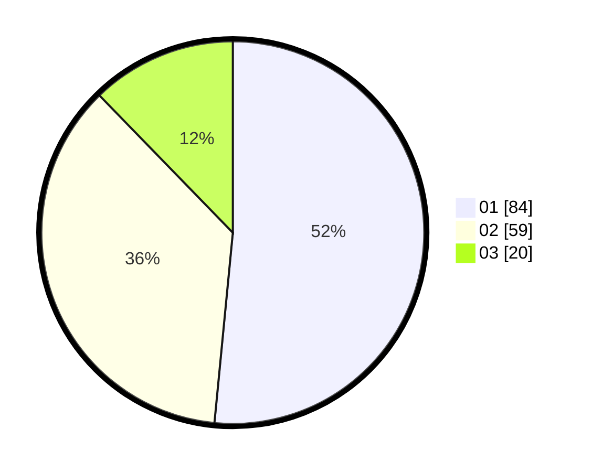

# Hasil

Hasil perolehan suara paslon dapat dilihat pada file paslon-01.txt, paslon-02.txt, dan paslon-03.txt.

Jika tidak ada, artinya data tersebut belum ada pada SIREKAP.

## Perolehan Suara

 * Paslon 01: **84**.
 * Paslon 02: **59**.
 * Paslon 03: **20**.

## Foto C Plano

https://sirekap-obj-formc.kpu.go.id/f3b2/pemilu/ppwp/31/73/01/10/04/3173011004050-20240216-233447--9436ae1f-4bd8-4f98-89ef-27ce88ff4ad7.jpg

https://sirekap-obj-formc.kpu.go.id/f3b2/pemilu/ppwp/31/73/01/10/04/3173011004050-20240216-034825--b367e321-b550-4eff-907f-90dfb5fa1f0c.jpg

https://sirekap-obj-formc.kpu.go.id/f3b2/pemilu/ppwp/31/73/01/10/04/3173011004050-20240216-034818--f4583b59-98a0-408d-ac3d-6067abedd0ae.jpg

## DATA PEMILIH TETAP

Jumlah pemilih dalam DPT: **284**.
 * L: **147**.
 * P: **137**.

## DATA PENGGUNA HAK PILIH

Jumlah pengguna hak pilih dalam DPT: **166**.
 * L: **82**.
 * P: **84**.

Jumlah pengguna hak pilih dalam DPTb: **0**.
 * L: **0**.
 * P: **0**.

Jumlah pengguna hak pilih dalam DPK: **0**.
 * L: **0**.
 * P: **0**.

Jumlah pengguna hak pilih: **166**.
 * L: **82**.
 * P: **84**.

## JUMLAH SUARA SAH DAN TIDAK SAH

JUMLAH SELURUH SUARA SAH: **163**.

JUMLAH SUARA TIDAK SAH: **3**.

JUMLAH SELURUH SUARA SAH DAN SUARA TIDAK SAH: **166**.
