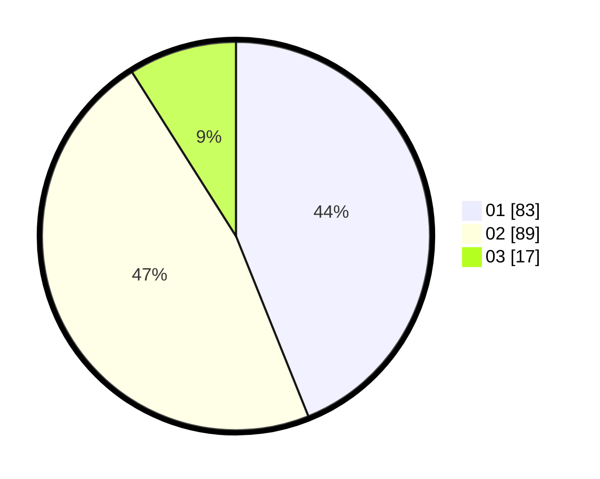

# Hasil

Hasil perolehan suara paslon dapat dilihat pada file paslon-01.txt, paslon-02.txt, dan paslon-03.txt.

Jika tidak ada, artinya data tersebut belum ada pada SIREKAP.

## Perolehan Suara

 * Paslon 01: **83**.
 * Paslon 02: **89**.
 * Paslon 03: **17**.

## Foto C Plano

https://sirekap-obj-formc.kpu.go.id/1e02/pemilu/ppwp/31/73/01/10/04/3173011004052-20240214-214248--64c30dd9-c10d-4069-9c6f-fa58a82f226d.jpg

https://sirekap-obj-formc.kpu.go.id/1e02/pemilu/ppwp/31/73/01/10/04/3173011004052-20240214-214413--24c55354-70e6-4507-a8c9-ea17980307b3.jpg

https://sirekap-obj-formc.kpu.go.id/1e02/pemilu/ppwp/31/73/01/10/04/3173011004052-20240214-214611--e1e0640f-36af-487d-8335-24ea5c2498b4.jpg
