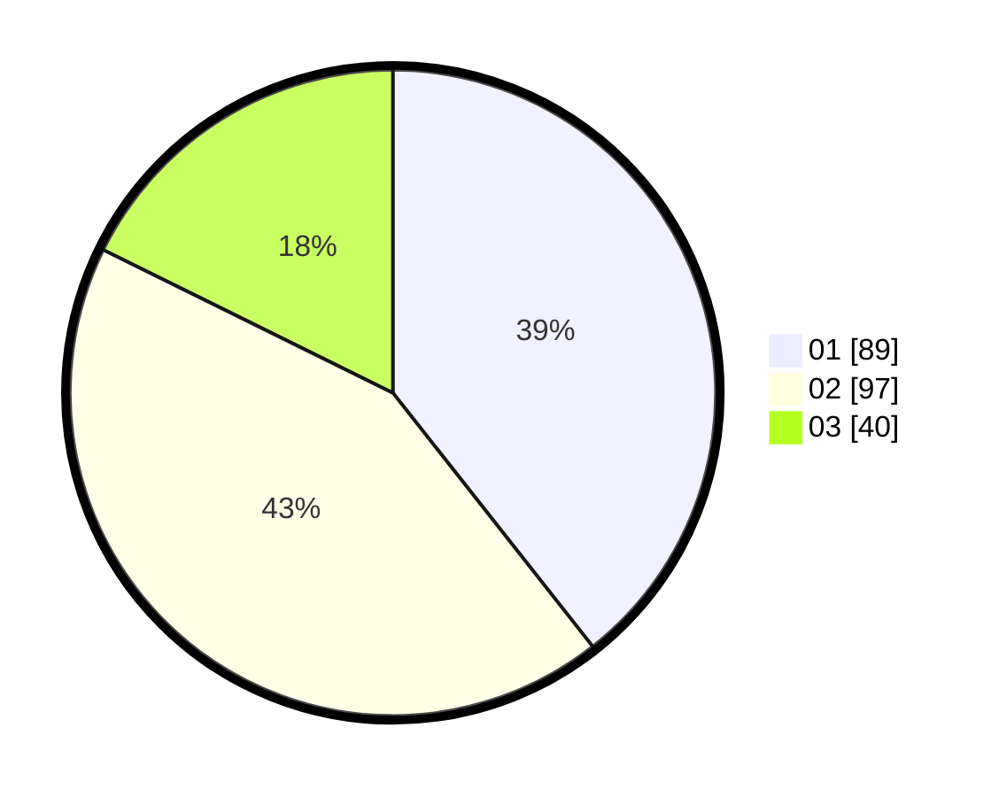

# Hasil

Hasil perolehan suara paslon dapat dilihat pada file paslon-01.txt, paslon-02.txt, dan paslon-03.txt.

Jika tidak ada, artinya data tersebut belum ada pada SIREKAP.

## Perolehan Suara

 * Paslon 01: **89**.
 * Paslon 02: **97**.
 * Paslon 03: **40**.

## Foto C Plano

https://sirekap-obj-formc.kpu.go.id/1c2a/pemilu/ppwp/31/73/01/10/04/3173011004054-20240214-211940--e0282d88-8654-4a4b-b0c1-ab6d3a349709.jpg

https://sirekap-obj-formc.kpu.go.id/1c2a/pemilu/ppwp/31/73/01/10/04/3173011004054-20240214-212044--efe70561-41b5-4507-ac1c-fda03fca49ff.jpg

https://sirekap-obj-formc.kpu.go.id/1c2a/pemilu/ppwp/31/73/01/10/04/3173011004054-20240214-212149--67323bac-7e7a-4ee0-ab22-6149d57fcbbc.jpg
