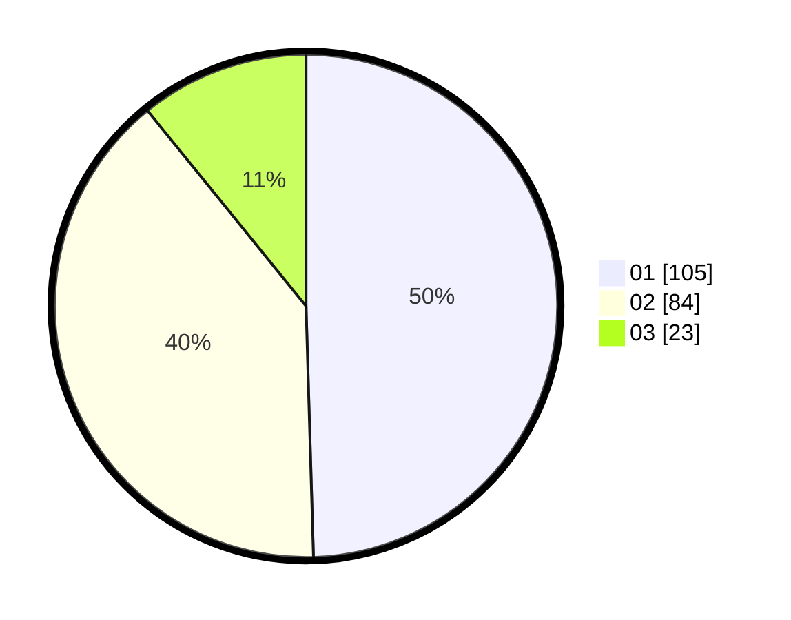

# Hasil

Hasil perolehan suara paslon dapat dilihat pada file paslon-01.txt, paslon-02.txt, dan paslon-03.txt.

Jika tidak ada, artinya data tersebut belum ada pada SIREKAP.

## Perolehan Suara

 * Paslon 01: **105**.
 * Paslon 02: **84**.
 * Paslon 03: **23**.

## Foto C Plano

https://sirekap-obj-formc.kpu.go.id/84b8/pemilu/ppwp/31/73/01/10/04/3173011004055-20240216-132416--bce5a785-d838-4986-b39c-ebf87bdf83e0.jpg

https://sirekap-obj-formc.kpu.go.id/84b8/pemilu/ppwp/31/73/01/10/04/3173011004055-20240214-224309--3e74392a-0b87-4838-95c4-ddcda8982f39.jpg

https://sirekap-obj-formc.kpu.go.id/84b8/pemilu/ppwp/31/73/01/10/04/3173011004055-20240214-155625--f2896448-3954-4a4c-b869-71d30e3efd46.jpg

## DATA PEMILIH TETAP

Jumlah pemilih dalam DPT: **282**.
 * L: **140**.
 * P: **142**.

## DATA PENGGUNA HAK PILIH

Jumlah pengguna hak pilih dalam DPT: **213**.
 * L: **104**.
 * P: **109**.

Jumlah pengguna hak pilih dalam DPTb: **1**.
 * L: **0**.
 * P: **1**.

Jumlah pengguna hak pilih dalam DPK: **1**.
 * L: **1**.
 * P: **0**.

Jumlah pengguna hak pilih: **215**.
 * L: **105**.
 * P: **110**.

## JUMLAH SUARA SAH DAN TIDAK SAH

JUMLAH SELURUH SUARA SAH: **212**.

JUMLAH SUARA TIDAK SAH: **3**.

JUMLAH SELURUH SUARA SAH DAN SUARA TIDAK SAH: **215**.
