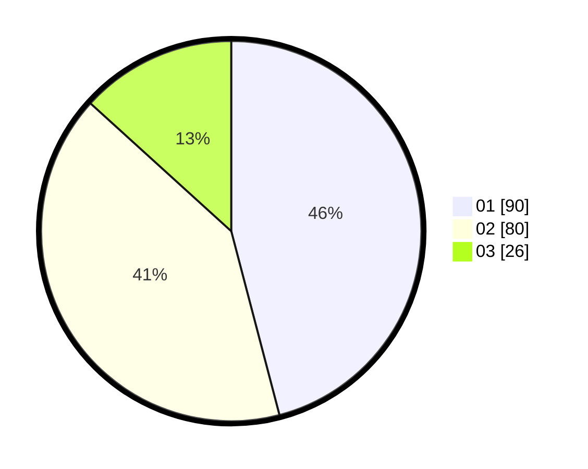

# Hasil

Hasil perolehan suara paslon dapat dilihat pada file paslon-01.txt, paslon-02.txt, dan paslon-03.txt.

Jika tidak ada, artinya data tersebut belum ada pada SIREKAP.

## Perolehan Suara

 * Paslon 01: **90**.
 * Paslon 02: **80**.
 * Paslon 03: **26**.

## Foto C Plano

https://sirekap-obj-formc.kpu.go.id/ceea/pemilu/ppwp/31/73/01/10/04/3173011004056-20240214-155103--42eed3a3-4b1a-49a3-a9fb-75bdce0cd8fb.jpg

https://sirekap-obj-formc.kpu.go.id/ceea/pemilu/ppwp/31/73/01/10/04/3173011004056-20240214-155202--22d6d046-ae1e-4012-afb4-a4e8be2e80b8.jpg

https://sirekap-obj-formc.kpu.go.id/ceea/pemilu/ppwp/31/73/01/10/04/3173011004056-20240214-155310--3b76a3d6-2f34-4523-9d6c-84020b5081d4.jpg
