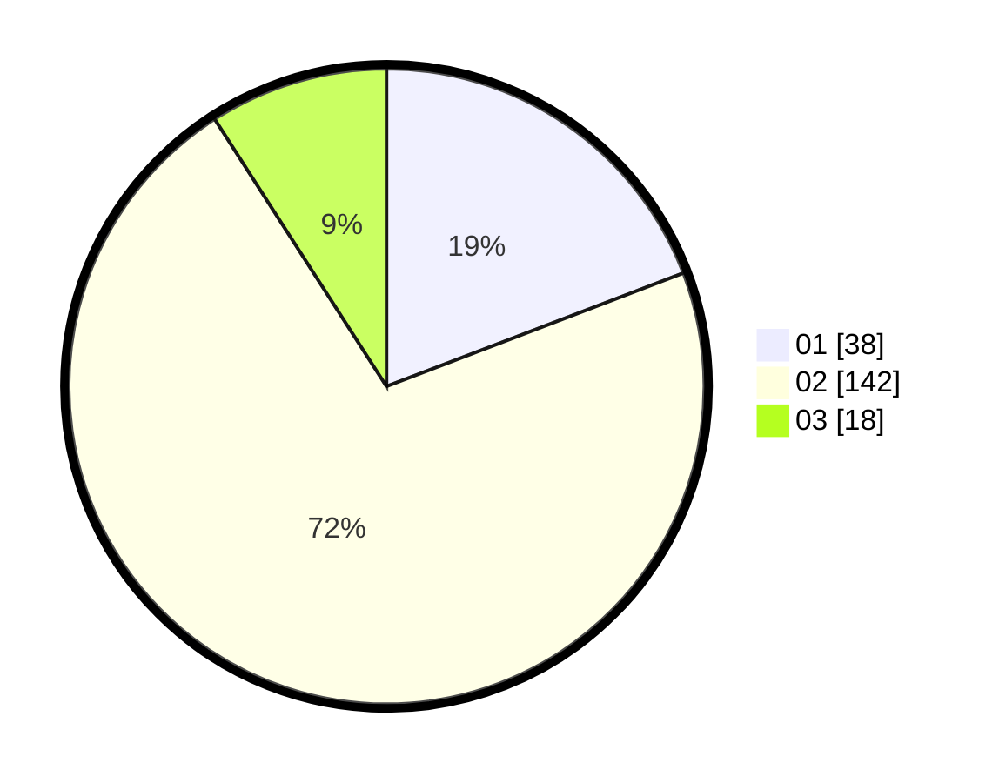

# Hasil

Hasil perolehan suara paslon dapat dilihat pada file paslon-01.txt, paslon-02.txt, dan paslon-03.txt.

Jika tidak ada, artinya data tersebut belum ada pada SIREKAP.

## Perolehan Suara

 * Paslon 01: **38**.
 * Paslon 02: **142**.
 * Paslon 03: **18**.

## Foto C Plano

https://sirekap-obj-formc.kpu.go.id/c2b9/pemilu/ppwp/31/73/01/10/04/3173011004059-20240216-004852--848b33c0-ab2c-40ef-8427-bf8cc99462c8.jpg

https://sirekap-obj-formc.kpu.go.id/c2b9/pemilu/ppwp/31/73/01/10/04/3173011004059-20240214-190716--642a43fd-1cc7-4ac8-ad85-cb990c7f4961.jpg

https://sirekap-obj-formc.kpu.go.id/c2b9/pemilu/ppwp/31/73/01/10/04/3173011004059-20240216-004852--fe6252af-e289-4769-a0d2-5eb6a12c8859.jpg

## DATA PEMILIH TETAP

Jumlah pemilih dalam DPT: **277**.
 * L: **142**.
 * P: **135**.

## DATA PENGGUNA HAK PILIH

Jumlah pengguna hak pilih dalam DPT: **194**.
 * L: **97**.
 * P: **97**.

Jumlah pengguna hak pilih dalam DPTb: **1**.
 * L: **1**.
 * P: **0**.

Jumlah pengguna hak pilih dalam DPK: **9**.
 * L: **3**.
 * P: **6**.

Jumlah pengguna hak pilih: **204**.
 * L: **101**.
 * P: **103**.

## JUMLAH SUARA SAH DAN TIDAK SAH

JUMLAH SELURUH SUARA SAH: **198**.

JUMLAH SUARA TIDAK SAH: **6**.

JUMLAH SELURUH SUARA SAH DAN SUARA TIDAK SAH: **204**.
