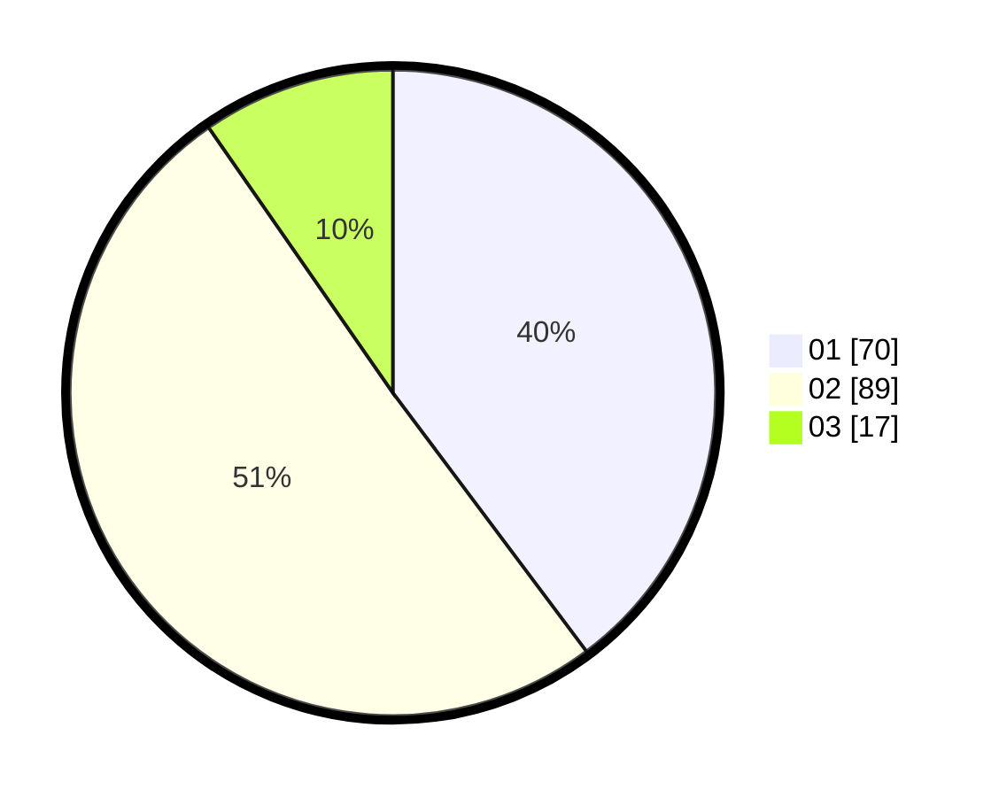

# Hasil

Hasil perolehan suara paslon dapat dilihat pada file paslon-01.txt, paslon-02.txt, dan paslon-03.txt.

Jika tidak ada, artinya data tersebut belum ada pada SIREKAP.

## Perolehan Suara

 * Paslon 01: **70**.
 * Paslon 02: **89**.
 * Paslon 03: **17**.

## Foto C Plano

https://sirekap-obj-formc.kpu.go.id/35c0/pemilu/ppwp/31/73/01/10/04/3173011004060-20240214-155704--97767ea5-5e72-4c51-9aa6-ae7d85b638b0.jpg

https://sirekap-obj-formc.kpu.go.id/35c0/pemilu/ppwp/31/73/01/10/04/3173011004060-20240214-155710--cce0bd81-1326-4704-a0a2-5d246190f4bc.jpg

https://sirekap-obj-formc.kpu.go.id/35c0/pemilu/ppwp/31/73/01/10/04/3173011004060-20240214-155735--1bcb095a-8cf5-4c88-8c29-c42c1a8ed219.jpg
