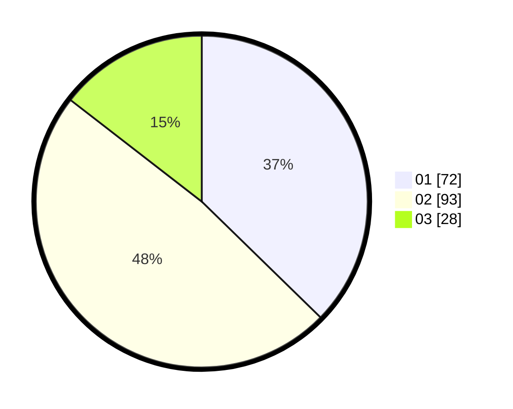

# Hasil

Hasil perolehan suara paslon dapat dilihat pada file paslon-01.txt, paslon-02.txt, dan paslon-03.txt.

Jika tidak ada, artinya data tersebut belum ada pada SIREKAP.

## Perolehan Suara

 * Paslon 01: **72**.
 * Paslon 02: **93**.
 * Paslon 03: **28**.

## Foto C Plano

https://sirekap-obj-formc.kpu.go.id/82aa/pemilu/ppwp/31/73/01/10/04/3173011004061-20240216-033555--7dc4628a-eba4-4fce-8991-8c52b269d5b3.jpg

https://sirekap-obj-formc.kpu.go.id/82aa/pemilu/ppwp/31/73/01/10/04/3173011004061-20240216-033557--ba0e928b-8b7e-4442-9b5c-eb8ef4f47aa0.jpg

https://sirekap-obj-formc.kpu.go.id/82aa/pemilu/ppwp/31/73/01/10/04/3173011004061-20240216-033556--1c828816-c90d-48bb-83d6-d6a9c25431b6.jpg

## DATA PEMILIH TETAP

Jumlah pemilih dalam DPT: **0**.
 * L: **0**.
 * P: **0**.

## DATA PENGGUNA HAK PILIH

Jumlah pengguna hak pilih dalam DPT: **0**.
 * L: **0**.
 * P: **0**.

Jumlah pengguna hak pilih dalam DPTb: **0**.
 * L: **0**.
 * P: **0**.

Jumlah pengguna hak pilih dalam DPK: **0**.
 * L: **0**.
 * P: **0**.

Jumlah pengguna hak pilih: **0**.
 * L: **0**.
 * P: **0**.

## JUMLAH SUARA SAH DAN TIDAK SAH

JUMLAH SELURUH SUARA SAH: **193**.

JUMLAH SUARA TIDAK SAH: **0**.

JUMLAH SELURUH SUARA SAH DAN SUARA TIDAK SAH: **193**.
