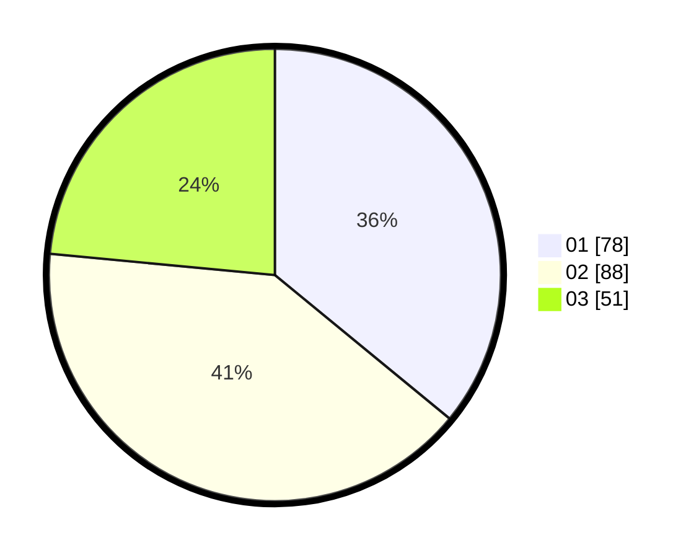

# Hasil

Hasil perolehan suara paslon dapat dilihat pada file paslon-01.txt, paslon-02.txt, dan paslon-03.txt.

Jika tidak ada, artinya data tersebut belum ada pada SIREKAP.

## Perolehan Suara

 * Paslon 01: **78**.
 * Paslon 02: **88**.
 * Paslon 03: **51**.

## Foto C Plano

https://sirekap-obj-formc.kpu.go.id/2203/pemilu/ppwp/31/73/01/10/04/3173011004065-20240214-212038--3db9abc5-b142-414b-b052-549588c9f243.jpg

https://sirekap-obj-formc.kpu.go.id/2203/pemilu/ppwp/31/73/01/10/04/3173011004065-20240214-194709--800e2173-4705-4ae8-a9d5-30fefc6a6aac.jpg

https://sirekap-obj-formc.kpu.go.id/2203/pemilu/ppwp/31/73/01/10/04/3173011004065-20240214-194802--293782c0-ebc2-4996-abeb-414c04c06e27.jpg
