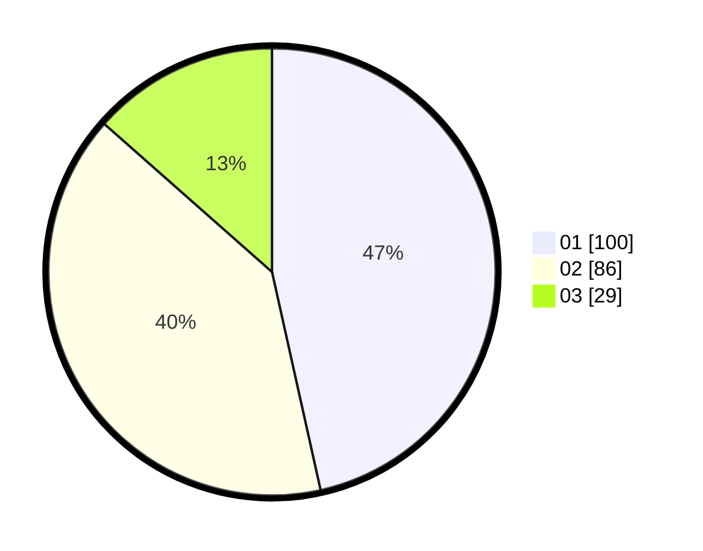

# Hasil

Hasil perolehan suara paslon dapat dilihat pada file paslon-01.txt, paslon-02.txt, dan paslon-03.txt.

Jika tidak ada, artinya data tersebut belum ada pada SIREKAP.

## Perolehan Suara

 * Paslon 01: **100**.
 * Paslon 02: **86**.
 * Paslon 03: **29**.

## Foto C Plano

https://sirekap-obj-formc.kpu.go.id/21fc/pemilu/ppwp/31/73/01/10/04/3173011004066-20240215-035256--59e499fa-9b6a-4476-beb4-291ed2b6497a.jpg

https://sirekap-obj-formc.kpu.go.id/21fc/pemilu/ppwp/31/73/01/10/04/3173011004066-20240215-035318--df0d94ff-3063-4b76-a182-6604620610a9.jpg

https://sirekap-obj-formc.kpu.go.id/21fc/pemilu/ppwp/31/73/01/10/04/3173011004066-20240215-035307--9ada33da-bb58-4529-8eef-850697604e19.jpg

## DATA PEMILIH TETAP

Jumlah pemilih dalam DPT: **292**.
 * L: **154**.
 * P: **138**.

## DATA PENGGUNA HAK PILIH

Jumlah pengguna hak pilih dalam DPT: **215**.
 * L: **108**.
 * P: **107**.

Jumlah pengguna hak pilih dalam DPTb: **3**.
 * L: **0**.
 * P: **3**.

Jumlah pengguna hak pilih dalam DPK: **6**.
 * L: **3**.
 * P: **3**.

Jumlah pengguna hak pilih: **224**.
 * L: **111**.
 * P: **113**.

## JUMLAH SUARA SAH DAN TIDAK SAH

JUMLAH SELURUH SUARA SAH: **215**.

JUMLAH SUARA TIDAK SAH: **9**.

JUMLAH SELURUH SUARA SAH DAN SUARA TIDAK SAH: **224**.
