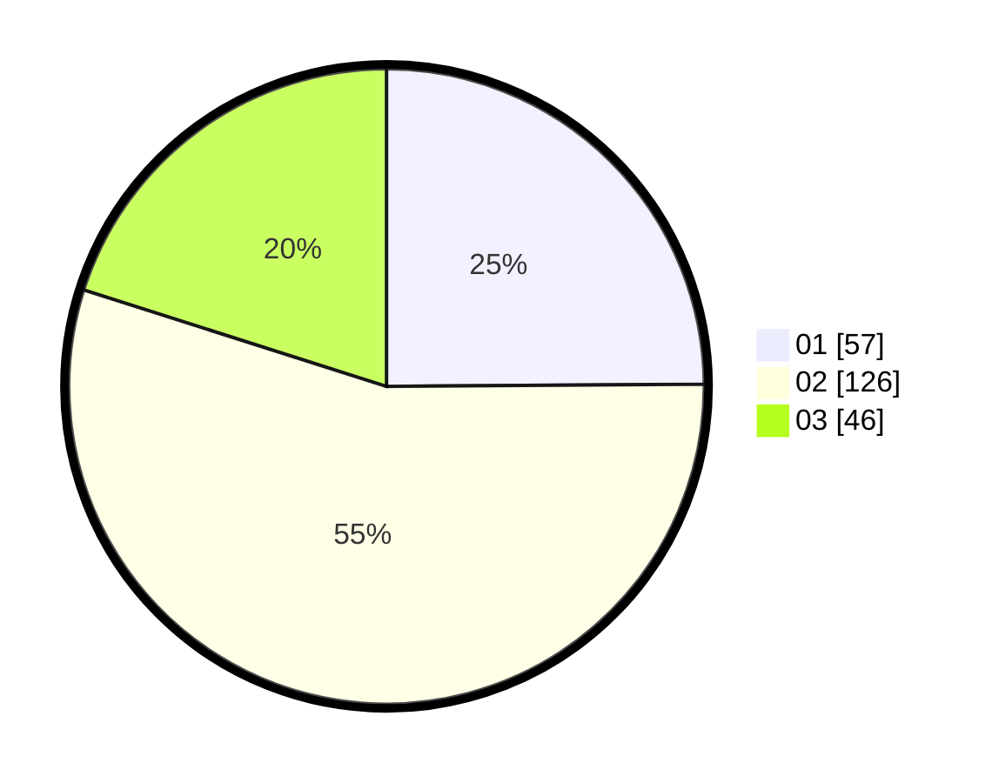

# Hasil

Hasil perolehan suara paslon dapat dilihat pada file paslon-01.txt, paslon-02.txt, dan paslon-03.txt.

Jika tidak ada, artinya data tersebut belum ada pada SIREKAP.

## Perolehan Suara

 * Paslon 01: **57**.
 * Paslon 02: **126**.
 * Paslon 03: **46**.

## Foto C Plano

https://sirekap-obj-formc.kpu.go.id/4171/pemilu/ppwp/31/73/01/10/04/3173011004068-20240215-232530--08b50adb-bd49-48bb-a957-2dc2ce36b7d2.jpg

https://sirekap-obj-formc.kpu.go.id/4171/pemilu/ppwp/31/73/01/10/04/3173011004068-20240215-232533--937b437d-054c-4261-943c-a11bb893434b.jpg

https://sirekap-obj-formc.kpu.go.id/4171/pemilu/ppwp/31/73/01/10/04/3173011004068-20240215-232531--6fa012a4-9779-4613-8206-c6afc8b6af61.jpg

## DATA PEMILIH TETAP

Jumlah pemilih dalam DPT: **230**.
 * L: **100**.
 * P: **130**.

## DATA PENGGUNA HAK PILIH

Jumlah pengguna hak pilih dalam DPT: **230**.
 * L: **100**.
 * P: **130**.

Jumlah pengguna hak pilih dalam DPTb: **2**.
 * L: **1**.
 * P: **1**.

Jumlah pengguna hak pilih dalam DPK: **0**.
 * L: **0**.
 * P: **0**.

Jumlah pengguna hak pilih: **232**.
 * L: **101**.
 * P: **131**.

## JUMLAH SUARA SAH DAN TIDAK SAH

JUMLAH SELURUH SUARA SAH: **231**.

JUMLAH SUARA TIDAK SAH: **1**.

JUMLAH SELURUH SUARA SAH DAN SUARA TIDAK SAH: **232**.
