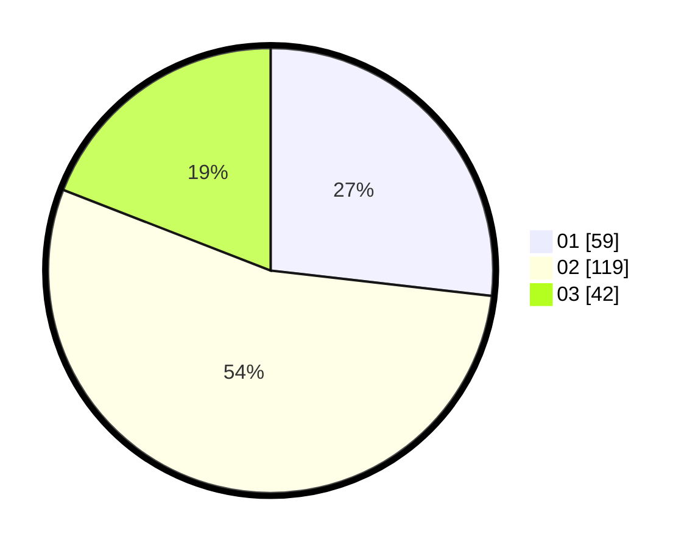

# Hasil

Hasil perolehan suara paslon dapat dilihat pada file paslon-01.txt, paslon-02.txt, dan paslon-03.txt.

Jika tidak ada, artinya data tersebut belum ada pada SIREKAP.

## Perolehan Suara

 * Paslon 01: **59**.
 * Paslon 02: **119**.
 * Paslon 03: **42**.

## Foto C Plano

https://sirekap-obj-formc.kpu.go.id/1e72/pemilu/ppwp/31/73/01/10/04/3173011004069-20240218-131951--c83dec17-3af7-49d5-9643-6de4730f9c96.jpg

https://sirekap-obj-formc.kpu.go.id/1e72/pemilu/ppwp/31/73/01/10/04/3173011004069-20240218-131953--7b6b0a89-29bd-429c-9a0b-2556583d985e.jpg

https://sirekap-obj-formc.kpu.go.id/1e72/pemilu/ppwp/31/73/01/10/04/3173011004069-20240218-131952--89dea575-53aa-4a02-b0ee-89e3fe08434b.jpg

## DATA PEMILIH TETAP

Jumlah pemilih dalam DPT: **269**.
 * L: **137**.
 * P: **132**.

## DATA PENGGUNA HAK PILIH

Jumlah pengguna hak pilih dalam DPT: **220**.
 * L: **108**.
 * P: **112**.

Jumlah pengguna hak pilih dalam DPTb: **0**.
 * L: **0**.
 * P: **0**.

Jumlah pengguna hak pilih dalam DPK: **2**.
 * L: **0**.
 * P: **2**.

Jumlah pengguna hak pilih: **222**.
 * L: **108**.
 * P: **114**.

## JUMLAH SUARA SAH DAN TIDAK SAH

JUMLAH SELURUH SUARA SAH: **220**.

JUMLAH SUARA TIDAK SAH: **2**.

JUMLAH SELURUH SUARA SAH DAN SUARA TIDAK SAH: **222**.
