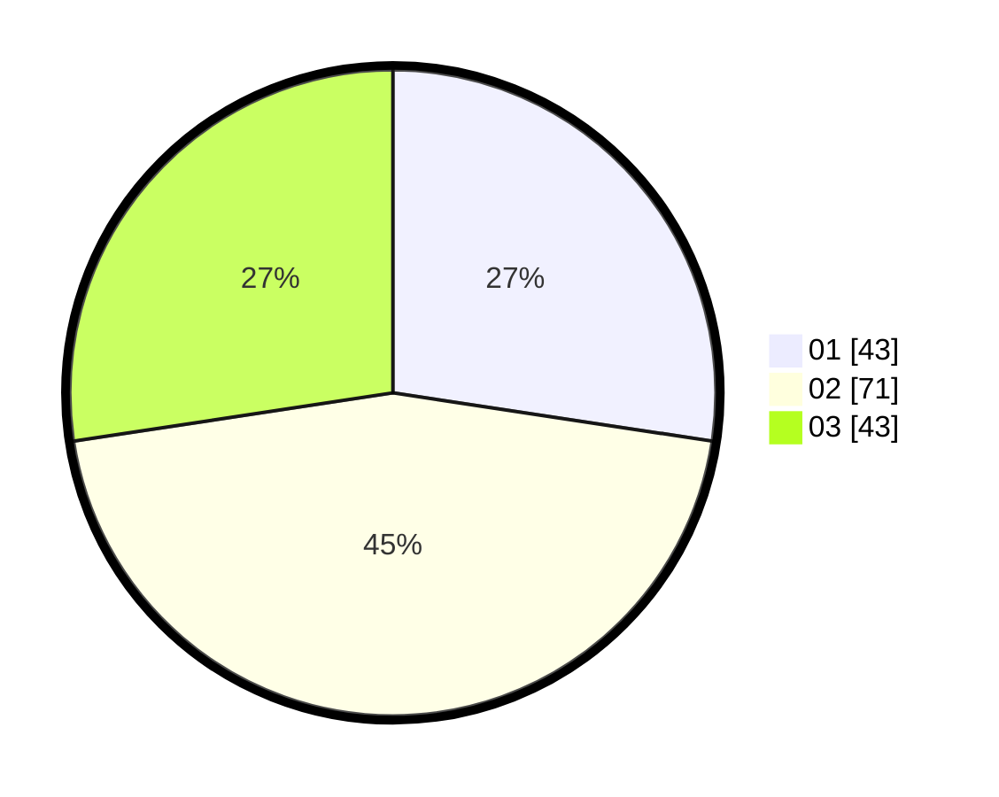

# Hasil

Hasil perolehan suara paslon dapat dilihat pada file paslon-01.txt, paslon-02.txt, dan paslon-03.txt.

Jika tidak ada, artinya data tersebut belum ada pada SIREKAP.

## Perolehan Suara

 * Paslon 01: **43**.
 * Paslon 02: **71**.
 * Paslon 03: **43**.

## Foto C Plano

https://sirekap-obj-formc.kpu.go.id/dafc/pemilu/ppwp/31/73/01/10/04/3173011004071-20240216-054407--0ead1732-ce5a-4708-b893-4e56ca2e8eb0.jpg

https://sirekap-obj-formc.kpu.go.id/dafc/pemilu/ppwp/31/73/01/10/04/3173011004071-20240216-053619--34b19480-81b0-4f40-b9e9-bf9c078049b4.jpg

https://sirekap-obj-formc.kpu.go.id/dafc/pemilu/ppwp/31/73/01/10/04/3173011004071-20240216-053618--fe997529-2ac6-4160-8d46-22d4bb3aa8c7.jpg

## DATA PEMILIH TETAP

Jumlah pemilih dalam DPT: **229**.
 * L: **119**.
 * P: **110**.

## DATA PENGGUNA HAK PILIH

Jumlah pengguna hak pilih dalam DPT: **156**.
 * L: **79**.
 * P: **77**.

Jumlah pengguna hak pilih dalam DPTb: **3**.
 * L: **1**.
 * P: **2**.

Jumlah pengguna hak pilih dalam DPK: **1**.
 * L: **0**.
 * P: **1**.

Jumlah pengguna hak pilih: **160**.
 * L: **80**.
 * P: **80**.

## JUMLAH SUARA SAH DAN TIDAK SAH

JUMLAH SELURUH SUARA SAH: **157**.

JUMLAH SUARA TIDAK SAH: **3**.

JUMLAH SELURUH SUARA SAH DAN SUARA TIDAK SAH: **160**.
