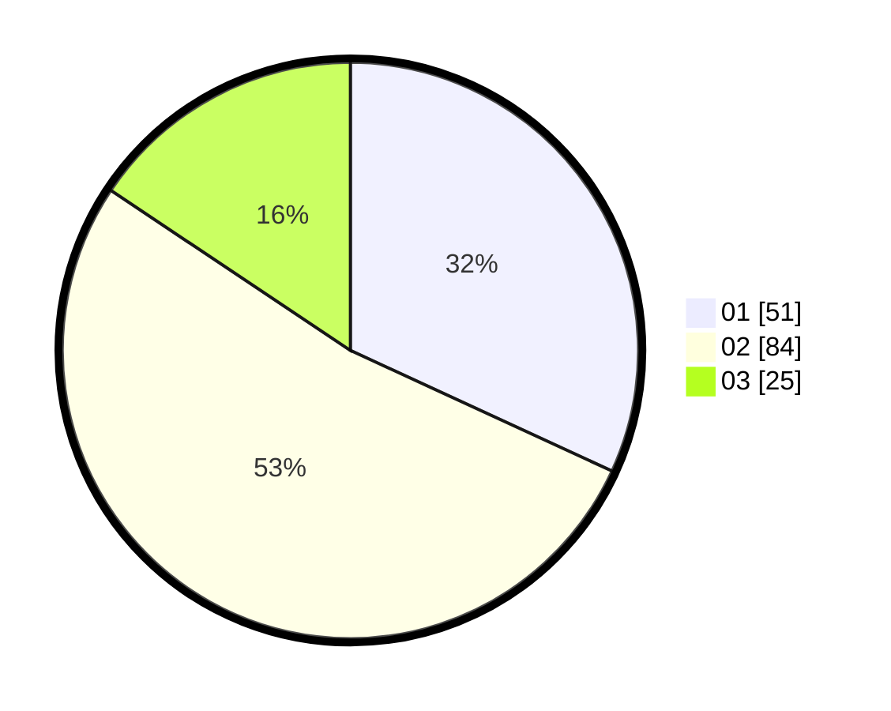

# Hasil

Hasil perolehan suara paslon dapat dilihat pada file paslon-01.txt, paslon-02.txt, dan paslon-03.txt.

Jika tidak ada, artinya data tersebut belum ada pada SIREKAP.

## Perolehan Suara

 * Paslon 01: **51**.
 * Paslon 02: **84**.
 * Paslon 03: **25**.

## Foto C Plano

https://sirekap-obj-formc.kpu.go.id/06f8/pemilu/ppwp/31/73/01/10/04/3173011004072-20240215-212432--c6d44d44-7d4b-4d6b-9a5d-ec2bb6c09217.jpg

https://sirekap-obj-formc.kpu.go.id/06f8/pemilu/ppwp/31/73/01/10/04/3173011004072-20240214-184923--f346a9e4-d8d2-4087-b1e5-f90986fcc613.jpg

https://sirekap-obj-formc.kpu.go.id/06f8/pemilu/ppwp/31/73/01/10/04/3173011004072-20240214-184923--aa5c65d2-a020-40c2-9777-d787404b71c6.jpg

## DATA PEMILIH TETAP

Jumlah pemilih dalam DPT: **218**.
 * L: **99**.
 * P: **119**.

## DATA PENGGUNA HAK PILIH

Jumlah pengguna hak pilih dalam DPT: **157**.
 * L: **71**.
 * P: **86**.

Jumlah pengguna hak pilih dalam DPTb: **4**.
 * L: **1**.
 * P: **3**.

Jumlah pengguna hak pilih dalam DPK: **0**.
 * L: **0**.
 * P: **0**.

Jumlah pengguna hak pilih: **161**.
 * L: **72**.
 * P: **89**.

## JUMLAH SUARA SAH DAN TIDAK SAH

JUMLAH SELURUH SUARA SAH: **160**.

JUMLAH SUARA TIDAK SAH: **1**.

JUMLAH SELURUH SUARA SAH DAN SUARA TIDAK SAH: **161**.
