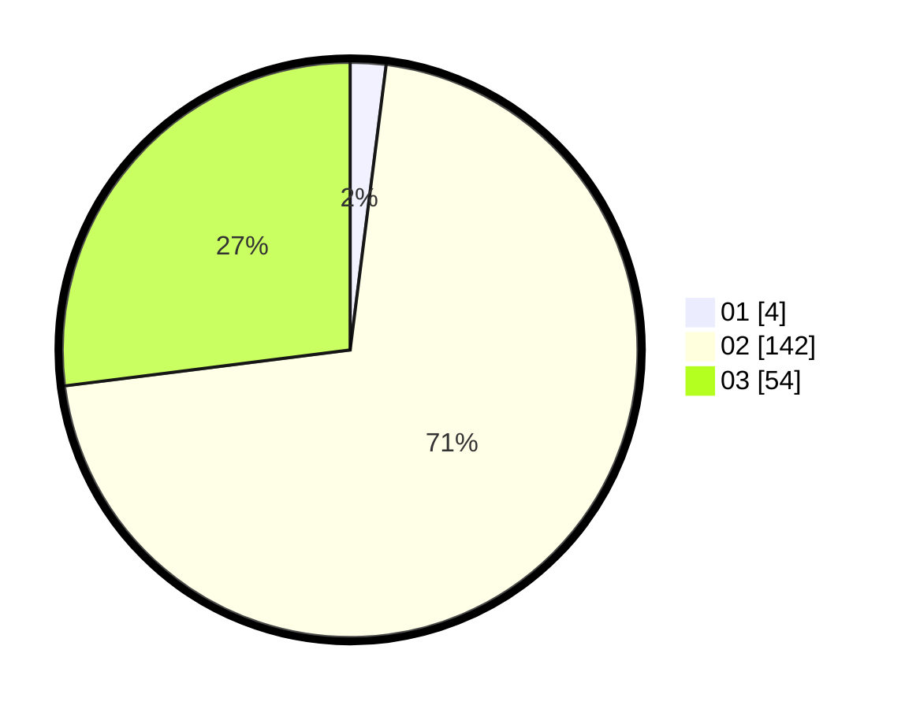

# Hasil

Hasil perolehan suara paslon dapat dilihat pada file paslon-01.txt, paslon-02.txt, dan paslon-03.txt.

Jika tidak ada, artinya data tersebut belum ada pada SIREKAP.

## Perolehan Suara

 * Paslon 01: **4**.
 * Paslon 02: **142**.
 * Paslon 03: **54**.

## Foto C Plano

https://sirekap-obj-formc.kpu.go.id/de71/pemilu/ppwp/31/73/01/10/04/3173011004076-20240215-062424--825808ba-1433-49a9-83cc-dd8043417055.jpg

https://sirekap-obj-formc.kpu.go.id/de71/pemilu/ppwp/31/73/01/10/04/3173011004076-20240215-062446--c1a8563b-8d9e-499e-90bb-b849498ae00f.jpg

https://sirekap-obj-formc.kpu.go.id/de71/pemilu/ppwp/31/73/01/10/04/3173011004076-20240215-062436--af071395-fb0a-4b76-a8c2-a3d6f3746b84.jpg

## DATA PEMILIH TETAP

Jumlah pemilih dalam DPT: **262**.
 * L: **120**.
 * P: **142**.

## DATA PENGGUNA HAK PILIH

Jumlah pengguna hak pilih dalam DPT: **196**.
 * L: **88**.
 * P: **108**.

Jumlah pengguna hak pilih dalam DPTb: **1**.
 * L: **1**.
 * P: **0**.

Jumlah pengguna hak pilih dalam DPK: **3**.
 * L: **2**.
 * P: **1**.

Jumlah pengguna hak pilih: **200**.
 * L: **91**.
 * P: **109**.

## JUMLAH SUARA SAH DAN TIDAK SAH

JUMLAH SELURUH SUARA SAH: **200**.

JUMLAH SUARA TIDAK SAH: **0**.

JUMLAH SELURUH SUARA SAH DAN SUARA TIDAK SAH: **200**.
