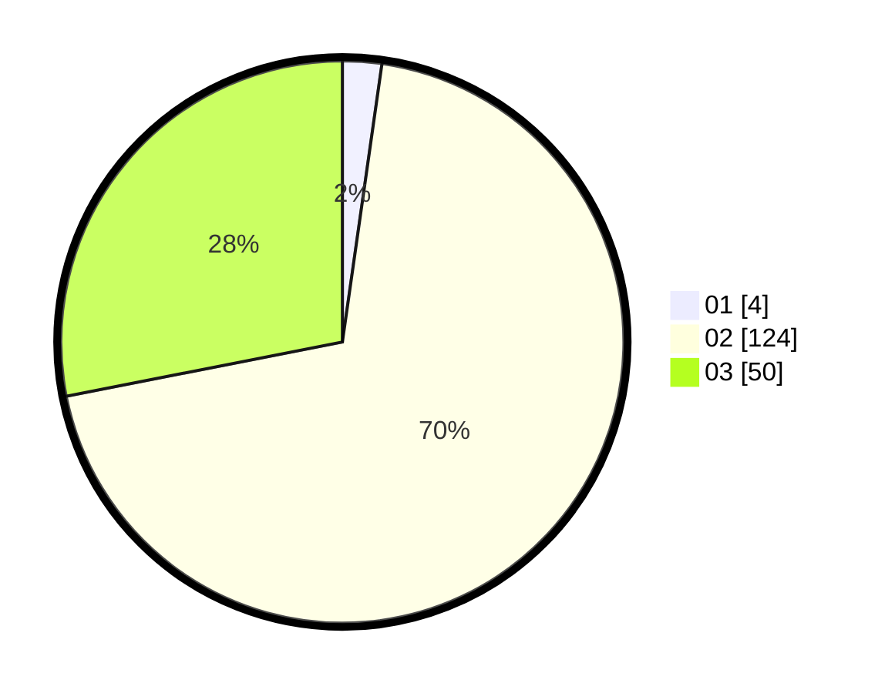

# Hasil

Hasil perolehan suara paslon dapat dilihat pada file paslon-01.txt, paslon-02.txt, dan paslon-03.txt.

Jika tidak ada, artinya data tersebut belum ada pada SIREKAP.

## Perolehan Suara

 * Paslon 01: **4**.
 * Paslon 02: **124**.
 * Paslon 03: **50**.

## Foto C Plano

https://sirekap-obj-formc.kpu.go.id/e3e8/pemilu/ppwp/31/73/01/10/04/3173011004077-20240215-001345--f8fd6b5b-0078-409b-a1fa-5fb0bb0a0c3c.jpg

https://sirekap-obj-formc.kpu.go.id/e3e8/pemilu/ppwp/31/73/01/10/04/3173011004077-20240215-000907--53e6032c-9d2d-462d-adcc-f0fc697cbd1a.jpg

https://sirekap-obj-formc.kpu.go.id/e3e8/pemilu/ppwp/31/73/01/10/04/3173011004077-20240215-001112--5784538d-6959-4626-98bc-e2a046addff1.jpg
