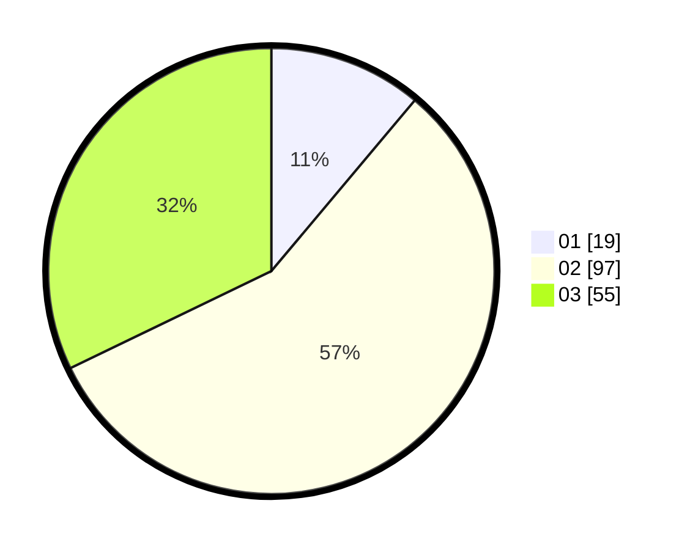

# Hasil

Hasil perolehan suara paslon dapat dilihat pada file paslon-01.txt, paslon-02.txt, dan paslon-03.txt.

Jika tidak ada, artinya data tersebut belum ada pada SIREKAP.

## Perolehan Suara

 * Paslon 01: **19**.
 * Paslon 02: **97**.
 * Paslon 03: **55**.

## Foto C Plano

https://sirekap-obj-formc.kpu.go.id/8825/pemilu/ppwp/31/73/01/10/04/3173011004079-20240214-210143--79dacdb1-113b-4705-9b73-5336409c2472.jpg

https://sirekap-obj-formc.kpu.go.id/8825/pemilu/ppwp/31/73/01/10/04/3173011004079-20240216-143127--c69b0e95-16ac-4a28-bb9b-14dffc1c490a.jpg

https://sirekap-obj-formc.kpu.go.id/8825/pemilu/ppwp/31/73/01/10/04/3173011004079-20240216-143127--8f80053e-481f-4e67-8f94-7d1f7d372a95.jpg

## DATA PEMILIH TETAP

Jumlah pemilih dalam DPT: **232**.
 * L: **114**.
 * P: **118**.

## DATA PENGGUNA HAK PILIH

Jumlah pengguna hak pilih dalam DPT: **167**.
 * L: **79**.
 * P: **88**.

Jumlah pengguna hak pilih dalam DPTb: **6**.
 * L: **4**.
 * P: **2**.

Jumlah pengguna hak pilih dalam DPK: **4**.
 * L: **2**.
 * P: **2**.

Jumlah pengguna hak pilih: **177**.
 * L: **85**.
 * P: **92**.

## JUMLAH SUARA SAH DAN TIDAK SAH

JUMLAH SELURUH SUARA SAH: **171**.

JUMLAH SUARA TIDAK SAH: **6**.

JUMLAH SELURUH SUARA SAH DAN SUARA TIDAK SAH: **177**.
