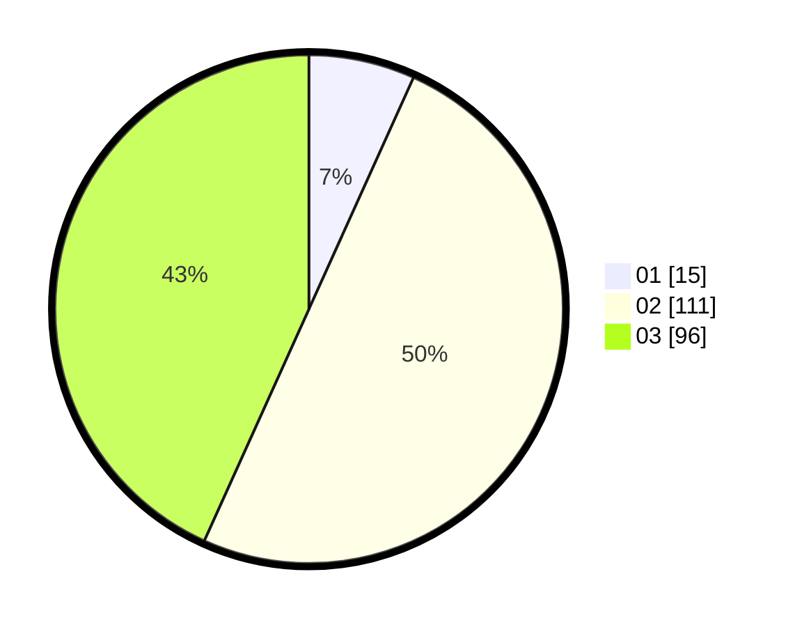

# Hasil

Hasil perolehan suara paslon dapat dilihat pada file paslon-01.txt, paslon-02.txt, dan paslon-03.txt.

Jika tidak ada, artinya data tersebut belum ada pada SIREKAP.

## Perolehan Suara

 * Paslon 01: **15**.
 * Paslon 02: **111**.
 * Paslon 03: **96**.

## Foto C Plano

https://sirekap-obj-formc.kpu.go.id/131d/pemilu/ppwp/31/73/01/10/04/3173011004080-20240216-044024--3e99bcd3-152d-4a89-81ff-8827b2ef4586.jpg

https://sirekap-obj-formc.kpu.go.id/131d/pemilu/ppwp/31/73/01/10/04/3173011004080-20240216-044025--a50a3dcd-22ec-45bf-93aa-a76beb3f5858.jpg

https://sirekap-obj-formc.kpu.go.id/131d/pemilu/ppwp/31/73/01/10/04/3173011004080-20240216-044024--c24b23b3-0945-4fbf-a57c-fbe57d921ee8.jpg

## DATA PEMILIH TETAP

Jumlah pemilih dalam DPT: **292**.
 * L: **144**.
 * P: **148**.

## DATA PENGGUNA HAK PILIH

Jumlah pengguna hak pilih dalam DPT: **219**.
 * L: **103**.
 * P: **116**.

Jumlah pengguna hak pilih dalam DPTb: **2**.
 * L: **2**.
 * P: **0**.

Jumlah pengguna hak pilih dalam DPK: **4**.
 * L: **2**.
 * P: **2**.

Jumlah pengguna hak pilih: **225**.
 * L: **107**.
 * P: **118**.

## JUMLAH SUARA SAH DAN TIDAK SAH

JUMLAH SELURUH SUARA SAH: **222**.

JUMLAH SUARA TIDAK SAH: **3**.

JUMLAH SELURUH SUARA SAH DAN SUARA TIDAK SAH: **225**.
