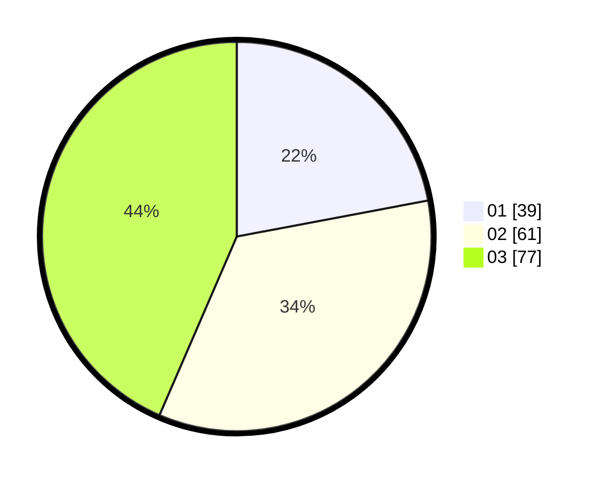

# Hasil

Hasil perolehan suara paslon dapat dilihat pada file paslon-01.txt, paslon-02.txt, dan paslon-03.txt.

Jika tidak ada, artinya data tersebut belum ada pada SIREKAP.

## Perolehan Suara

 * Paslon 01: **39**.
 * Paslon 02: **61**.
 * Paslon 03: **77**.

## Foto C Plano

https://sirekap-obj-formc.kpu.go.id/f203/pemilu/ppwp/31/73/01/10/04/3173011004081-20240214-155040--0615860d-7a15-42e3-8437-8bf9e89c0be4.jpg

https://sirekap-obj-formc.kpu.go.id/f203/pemilu/ppwp/31/73/01/10/04/3173011004081-20240214-155859--cecdc193-2ca8-4b5a-9f38-2e88788e931f.jpg

https://sirekap-obj-formc.kpu.go.id/f203/pemilu/ppwp/31/73/01/10/04/3173011004081-20240214-160111--a4563550-539e-4cc2-8d29-4c600350e2ca.jpg

## DATA PEMILIH TETAP

Jumlah pemilih dalam DPT: **252**.
 * L: **120**.
 * P: **132**.

## DATA PENGGUNA HAK PILIH

Jumlah pengguna hak pilih dalam DPT: **176**.
 * L: **78**.
 * P: **98**.

Jumlah pengguna hak pilih dalam DPTb: **1**.
 * L: **1**.
 * P: **0**.

Jumlah pengguna hak pilih dalam DPK: **1**.
 * L: **1**.
 * P: **0**.

Jumlah pengguna hak pilih: **178**.
 * L: **80**.
 * P: **98**.

## JUMLAH SUARA SAH DAN TIDAK SAH

JUMLAH SELURUH SUARA SAH: **177**.

JUMLAH SUARA TIDAK SAH: **1**.

JUMLAH SELURUH SUARA SAH DAN SUARA TIDAK SAH: **178**.
