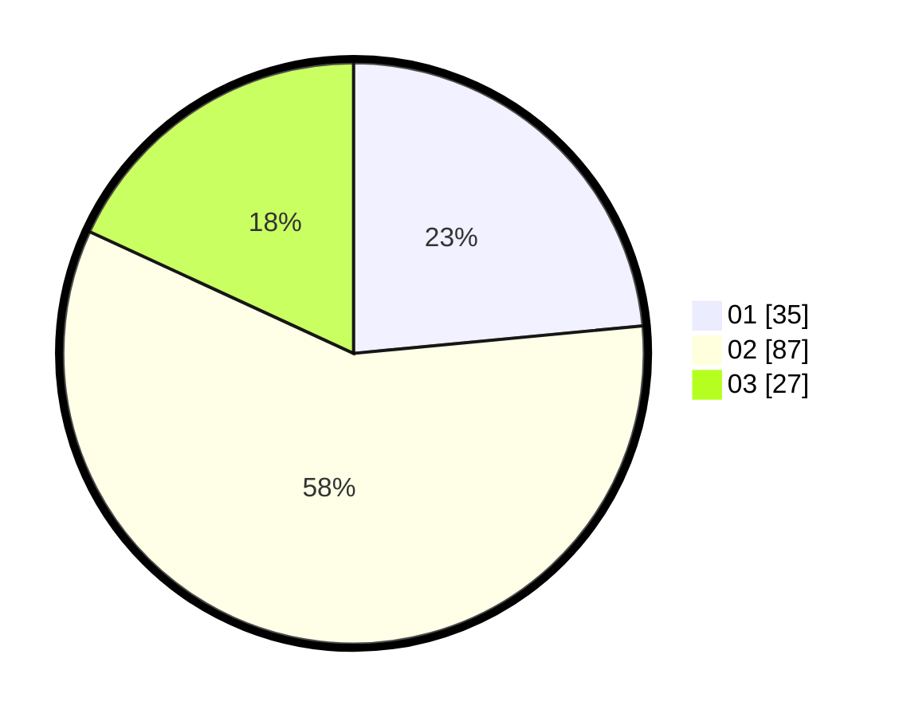

# Hasil

Hasil perolehan suara paslon dapat dilihat pada file paslon-01.txt, paslon-02.txt, dan paslon-03.txt.

Jika tidak ada, artinya data tersebut belum ada pada SIREKAP.

## Perolehan Suara

 * Paslon 01: **35**.
 * Paslon 02: **87**.
 * Paslon 03: **27**.

## Foto C Plano

https://sirekap-obj-formc.kpu.go.id/d6a3/pemilu/ppwp/31/73/01/10/04/3173011004083-20240214-141459--d3df223f-db0d-4f4a-a25d-017dd33b75ad.jpg

https://sirekap-obj-formc.kpu.go.id/d6a3/pemilu/ppwp/31/73/01/10/04/3173011004083-20240214-192759--8ed85fc1-763d-4a7d-a331-3bcfb35f6682.jpg

https://sirekap-obj-formc.kpu.go.id/d6a3/pemilu/ppwp/31/73/01/10/04/3173011004083-20240214-192920--a9117516-75d7-4d1c-970a-525e952bb340.jpg

## DATA PEMILIH TETAP

Jumlah pemilih dalam DPT: **211**.
 * L: **112**.
 * P: **99**.

## DATA PENGGUNA HAK PILIH

Jumlah pengguna hak pilih dalam DPT: **152**.
 * L: **75**.
 * P: **77**.

Jumlah pengguna hak pilih dalam DPTb: **0**.
 * L: **0**.
 * P: **0**.

Jumlah pengguna hak pilih dalam DPK: **0**.
 * L: **0**.
 * P: **0**.

Jumlah pengguna hak pilih: **152**.
 * L: **75**.
 * P: **77**.

## JUMLAH SUARA SAH DAN TIDAK SAH

JUMLAH SELURUH SUARA SAH: **149**.

JUMLAH SUARA TIDAK SAH: **3**.

JUMLAH SELURUH SUARA SAH DAN SUARA TIDAK SAH: **152**.
