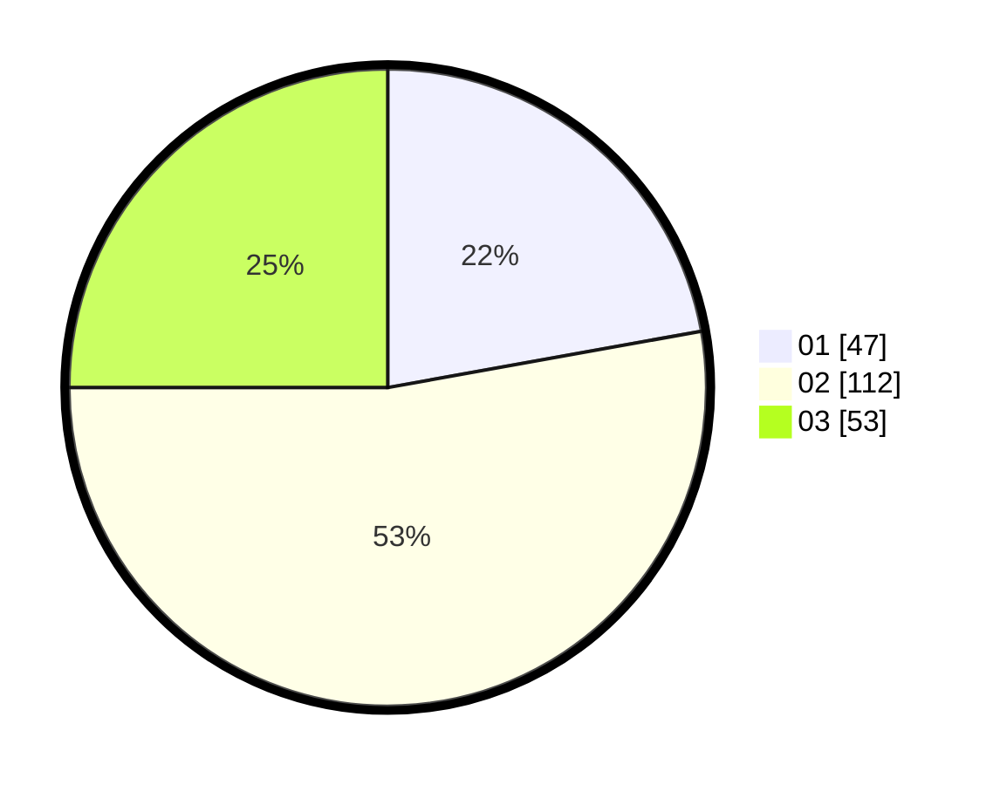

# Hasil

Hasil perolehan suara paslon dapat dilihat pada file paslon-01.txt, paslon-02.txt, dan paslon-03.txt.

Jika tidak ada, artinya data tersebut belum ada pada SIREKAP.

## Perolehan Suara

 * Paslon 01: **47**.
 * Paslon 02: **112**.
 * Paslon 03: **53**.

## Foto C Plano

https://sirekap-obj-formc.kpu.go.id/72e1/pemilu/ppwp/31/73/01/10/04/3173011004084-20240216-032652--8c63b5c7-003f-484a-8734-c2f5be54e601.jpg

https://sirekap-obj-formc.kpu.go.id/72e1/pemilu/ppwp/31/73/01/10/04/3173011004084-20240216-032654--c987e599-40dc-43d5-ac3b-abfed279bd73.jpg

https://sirekap-obj-formc.kpu.go.id/72e1/pemilu/ppwp/31/73/01/10/04/3173011004084-20240216-032652--c7275a10-8274-44bf-826b-a55c97f0d694.jpg

## DATA PEMILIH TETAP

Jumlah pemilih dalam DPT: **261**.
 * L: **135**.
 * P: **126**.

## DATA PENGGUNA HAK PILIH

Jumlah pengguna hak pilih dalam DPT: **212**.
 * L: **106**.
 * P: **106**.

Jumlah pengguna hak pilih dalam DPTb: **3**.
 * L: **2**.
 * P: **1**.

Jumlah pengguna hak pilih dalam DPK: **0**.
 * L: **0**.
 * P: **0**.

Jumlah pengguna hak pilih: **215**.
 * L: **108**.
 * P: **107**.

## JUMLAH SUARA SAH DAN TIDAK SAH

JUMLAH SELURUH SUARA SAH: **212**.

JUMLAH SUARA TIDAK SAH: **3**.

JUMLAH SELURUH SUARA SAH DAN SUARA TIDAK SAH: **215**.
