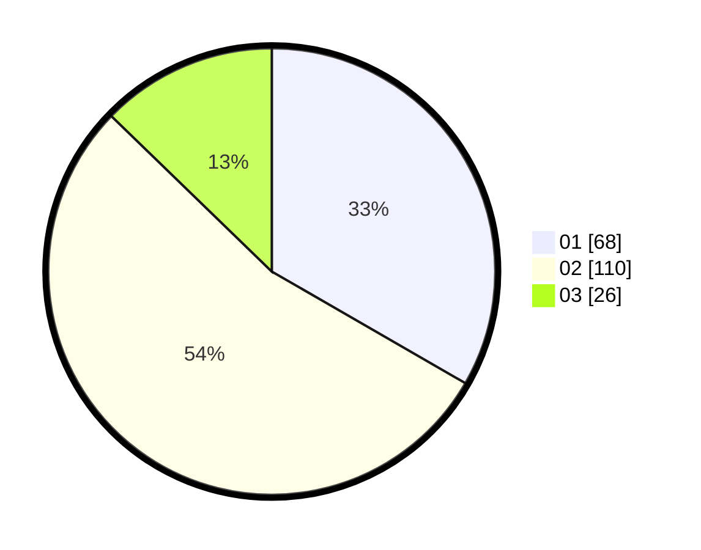

# Hasil

Hasil perolehan suara paslon dapat dilihat pada file paslon-01.txt, paslon-02.txt, dan paslon-03.txt.

Jika tidak ada, artinya data tersebut belum ada pada SIREKAP.

## Perolehan Suara

 * Paslon 01: **68**.
 * Paslon 02: **110**.
 * Paslon 03: **26**.

## Foto C Plano

https://sirekap-obj-formc.kpu.go.id/3531/pemilu/ppwp/31/73/01/10/04/3173011004085-20240214-220740--6fa639fa-a3e8-4c84-81de-bfdf6c7bc581.jpg

https://sirekap-obj-formc.kpu.go.id/3531/pemilu/ppwp/31/73/01/10/04/3173011004085-20240214-192812--ea047806-caf0-42d7-8fab-6cd92a3f19cf.jpg

https://sirekap-obj-formc.kpu.go.id/3531/pemilu/ppwp/31/73/01/10/04/3173011004085-20240214-192915--52d25912-7964-48eb-be41-5461b8346133.jpg

## DATA PEMILIH TETAP

Jumlah pemilih dalam DPT: **288**.
 * L: **147**.
 * P: **141**.

## DATA PENGGUNA HAK PILIH

Jumlah pengguna hak pilih dalam DPT: **202**.
 * L: **103**.
 * P: **99**.

Jumlah pengguna hak pilih dalam DPTb: **3**.
 * L: **2**.
 * P: **1**.

Jumlah pengguna hak pilih dalam DPK: **2**.
 * L: **2**.
 * P: **0**.

Jumlah pengguna hak pilih: **207**.
 * L: **107**.
 * P: **100**.

## JUMLAH SUARA SAH DAN TIDAK SAH

JUMLAH SELURUH SUARA SAH: **204**.

JUMLAH SUARA TIDAK SAH: **3**.

JUMLAH SELURUH SUARA SAH DAN SUARA TIDAK SAH: **207**.
