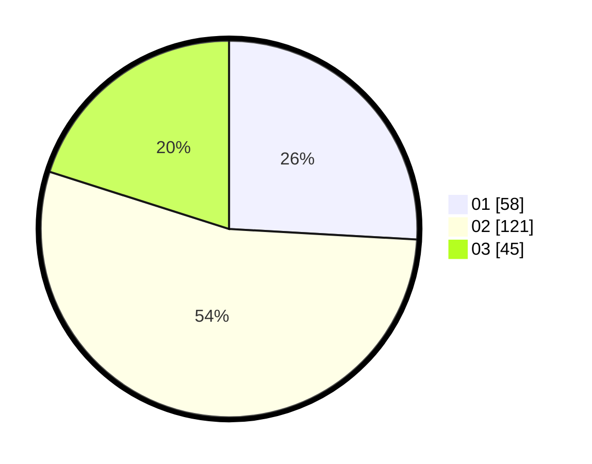

# Hasil

Hasil perolehan suara paslon dapat dilihat pada file paslon-01.txt, paslon-02.txt, dan paslon-03.txt.

Jika tidak ada, artinya data tersebut belum ada pada SIREKAP.

## Perolehan Suara

 * Paslon 01: **58**.
 * Paslon 02: **121**.
 * Paslon 03: **45**.

## Foto C Plano

https://sirekap-obj-formc.kpu.go.id/4be6/pemilu/ppwp/31/73/01/10/04/3173011004086-20240214-155241--dbf1245c-0b22-4add-b4c3-2ffbc0f9c7a1.jpg

https://sirekap-obj-formc.kpu.go.id/4be6/pemilu/ppwp/31/73/01/10/04/3173011004086-20240214-155359--0c2a0666-5493-4d85-af3c-ca9328a8628b.jpg

https://sirekap-obj-formc.kpu.go.id/4be6/pemilu/ppwp/31/73/01/10/04/3173011004086-20240214-155439--5bd94a8a-3928-4f46-a3b7-1f562600a9da.jpg

## DATA PEMILIH TETAP

Jumlah pemilih dalam DPT: **285**.
 * L: **126**.
 * P: **159**.

## DATA PENGGUNA HAK PILIH

Jumlah pengguna hak pilih dalam DPT: **223**.
 * L: **97**.
 * P: **126**.

Jumlah pengguna hak pilih dalam DPTb: **1**.
 * L: **1**.
 * P: **0**.

Jumlah pengguna hak pilih dalam DPK: **5**.
 * L: **2**.
 * P: **3**.

Jumlah pengguna hak pilih: **229**.
 * L: **100**.
 * P: **129**.

## JUMLAH SUARA SAH DAN TIDAK SAH

JUMLAH SELURUH SUARA SAH: **224**.

JUMLAH SUARA TIDAK SAH: **5**.

JUMLAH SELURUH SUARA SAH DAN SUARA TIDAK SAH: **229**.
