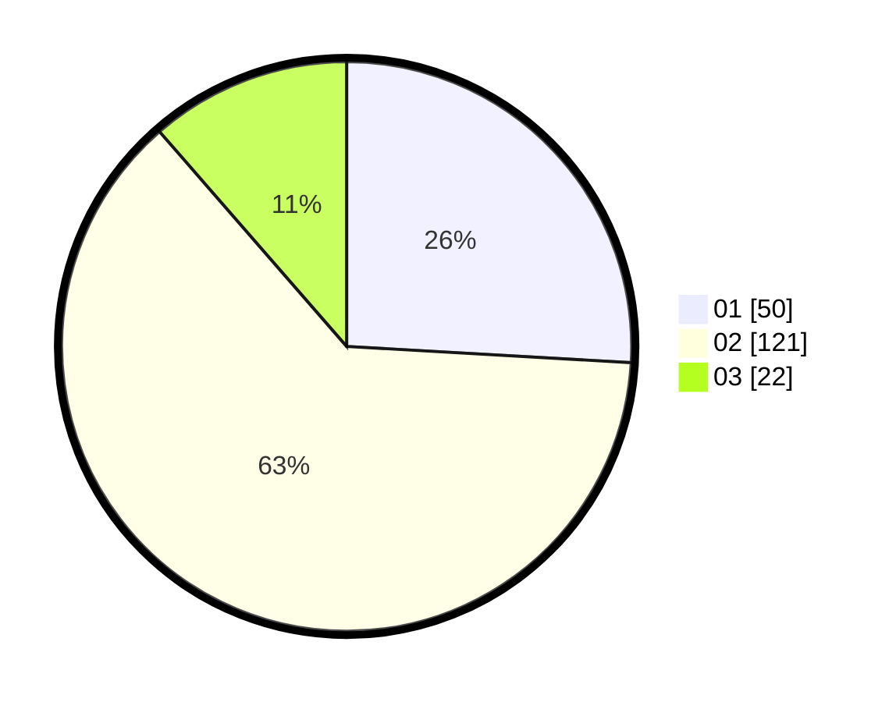

# Hasil

Hasil perolehan suara paslon dapat dilihat pada file paslon-01.txt, paslon-02.txt, dan paslon-03.txt.

Jika tidak ada, artinya data tersebut belum ada pada SIREKAP.

## Perolehan Suara

 * Paslon 01: **50**.
 * Paslon 02: **121**.
 * Paslon 03: **22**.

## Foto C Plano

https://sirekap-obj-formc.kpu.go.id/c51b/pemilu/ppwp/31/73/01/10/04/3173011004087-20240215-232355--7313d97e-90e9-4947-969b-c0301550219d.jpg

https://sirekap-obj-formc.kpu.go.id/c51b/pemilu/ppwp/31/73/01/10/04/3173011004087-20240215-231631--33c3abb5-997c-4347-9e71-faf39b188a35.jpg

https://sirekap-obj-formc.kpu.go.id/c51b/pemilu/ppwp/31/73/01/10/04/3173011004087-20240215-232302--6171c0a7-0f64-4b96-9d8b-74f7b2b74c04.jpg
