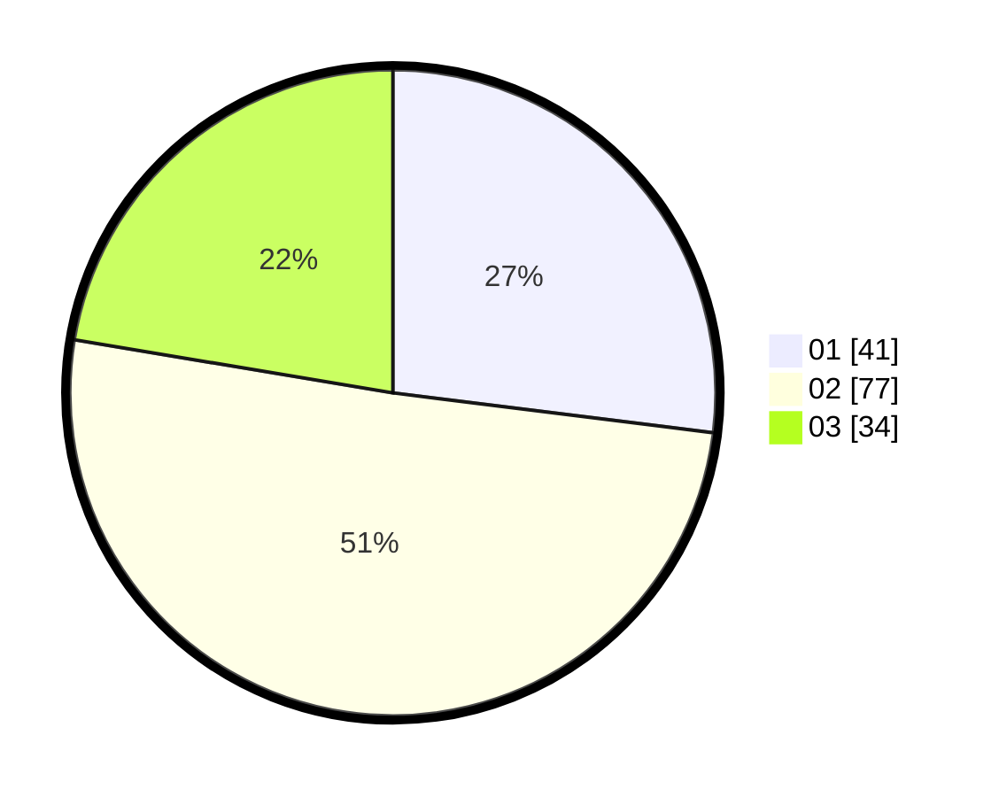

# Hasil

Hasil perolehan suara paslon dapat dilihat pada file paslon-01.txt, paslon-02.txt, dan paslon-03.txt.

Jika tidak ada, artinya data tersebut belum ada pada SIREKAP.

## Perolehan Suara

 * Paslon 01: **41**.
 * Paslon 02: **77**.
 * Paslon 03: **34**.

## Foto C Plano

https://sirekap-obj-formc.kpu.go.id/7a01/pemilu/ppwp/31/73/01/10/04/3173011004088-20240214-195119--e2ef3cf3-3632-403d-82c9-703fdff6a660.jpg

https://sirekap-obj-formc.kpu.go.id/7a01/pemilu/ppwp/31/73/01/10/04/3173011004088-20240214-195156--e296781b-e03b-491f-b6b8-bb1d4c6473ec.jpg

https://sirekap-obj-formc.kpu.go.id/7a01/pemilu/ppwp/31/73/01/10/04/3173011004088-20240216-175750--13cb193c-2d95-44b1-88b5-845ea9b18b75.jpg

## DATA PEMILIH TETAP

Jumlah pemilih dalam DPT: **226**.
 * L: **111**.
 * P: **115**.

## DATA PENGGUNA HAK PILIH

Jumlah pengguna hak pilih dalam DPT: **149**.
 * L: **72**.
 * P: **77**.

Jumlah pengguna hak pilih dalam DPTb: **2**.
 * L: **0**.
 * P: **2**.

Jumlah pengguna hak pilih dalam DPK: **1**.
 * L: **0**.
 * P: **1**.

Jumlah pengguna hak pilih: **152**.
 * L: **72**.
 * P: **80**.

## JUMLAH SUARA SAH DAN TIDAK SAH

JUMLAH SELURUH SUARA SAH: **152**.

JUMLAH SUARA TIDAK SAH: **0**.

JUMLAH SELURUH SUARA SAH DAN SUARA TIDAK SAH: **152**.
