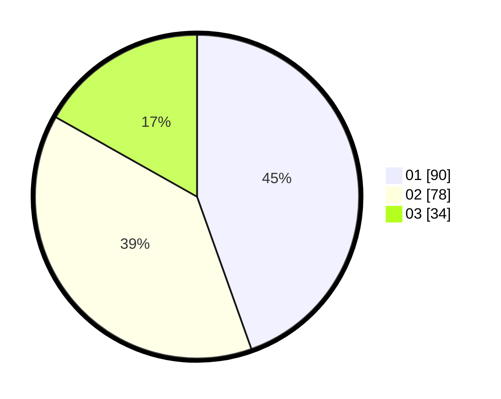

# Hasil

Hasil perolehan suara paslon dapat dilihat pada file paslon-01.txt, paslon-02.txt, dan paslon-03.txt.

Jika tidak ada, artinya data tersebut belum ada pada SIREKAP.

## Perolehan Suara

 * Paslon 01: **90**.
 * Paslon 02: **78**.
 * Paslon 03: **34**.

## Foto C Plano

https://sirekap-obj-formc.kpu.go.id/ff4b/pemilu/ppwp/31/73/01/10/04/3173011004092-20240215-230908--98655652-e6f1-4379-8027-b46d58a064d6.jpg

https://sirekap-obj-formc.kpu.go.id/ff4b/pemilu/ppwp/31/73/01/10/04/3173011004092-20240215-230911--34abb632-7313-4a66-96ef-045ba77763fc.jpg

https://sirekap-obj-formc.kpu.go.id/ff4b/pemilu/ppwp/31/73/01/10/04/3173011004092-20240215-230910--f51738f7-f6ef-4414-bdfc-0cb27cec0cb3.jpg

## DATA PEMILIH TETAP

Jumlah pemilih dalam DPT: **262**.
 * L: **129**.
 * P: **133**.

## DATA PENGGUNA HAK PILIH

Jumlah pengguna hak pilih dalam DPT: **203**.
 * L: **97**.
 * P: **106**.

Jumlah pengguna hak pilih dalam DPTb: **0**.
 * L: **0**.
 * P: **0**.

Jumlah pengguna hak pilih dalam DPK: **2**.
 * L: **1**.
 * P: **1**.

Jumlah pengguna hak pilih: **205**.
 * L: **98**.
 * P: **107**.

## JUMLAH SUARA SAH DAN TIDAK SAH

JUMLAH SELURUH SUARA SAH: **202**.

JUMLAH SUARA TIDAK SAH: **1**.

JUMLAH SELURUH SUARA SAH DAN SUARA TIDAK SAH: **203**.
