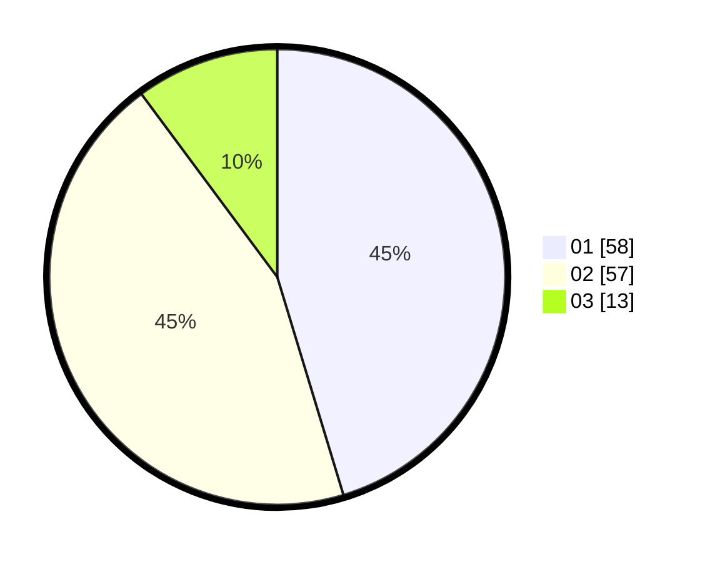

# Hasil

Hasil perolehan suara paslon dapat dilihat pada file paslon-01.txt, paslon-02.txt, dan paslon-03.txt.

Jika tidak ada, artinya data tersebut belum ada pada SIREKAP.

## Perolehan Suara

 * Paslon 01: **58**.
 * Paslon 02: **57**.
 * Paslon 03: **13**.

## Foto C Plano

https://sirekap-obj-formc.kpu.go.id/48a2/pemilu/ppwp/31/73/01/10/04/3173011004095-20240214-184558--389ad7e2-da8f-4d36-a808-99b07823cc3c.jpg

https://sirekap-obj-formc.kpu.go.id/48a2/pemilu/ppwp/31/73/01/10/04/3173011004095-20240214-191414--24ba2f5a-496c-4b72-a572-b1482bc60d20.jpg

https://sirekap-obj-formc.kpu.go.id/48a2/pemilu/ppwp/31/73/01/10/04/3173011004095-20240214-185929--02660058-6987-4bf0-abe7-8eb0c0737bb6.jpg

## DATA PEMILIH TETAP

Jumlah pemilih dalam DPT: **220**.
 * L: **112**.
 * P: **108**.

## DATA PENGGUNA HAK PILIH

Jumlah pengguna hak pilih dalam DPT: **130**.
 * L: **64**.
 * P: **66**.

Jumlah pengguna hak pilih dalam DPTb: **0**.
 * L: **0**.
 * P: **0**.

Jumlah pengguna hak pilih dalam DPK: **0**.
 * L: **0**.
 * P: **0**.

Jumlah pengguna hak pilih: **130**.
 * L: **64**.
 * P: **66**.

## JUMLAH SUARA SAH DAN TIDAK SAH

JUMLAH SELURUH SUARA SAH: **128**.

JUMLAH SUARA TIDAK SAH: **2**.

JUMLAH SELURUH SUARA SAH DAN SUARA TIDAK SAH: **130**.
