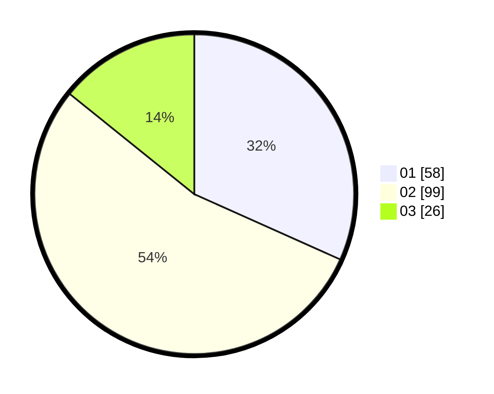

# Hasil

Hasil perolehan suara paslon dapat dilihat pada file paslon-01.txt, paslon-02.txt, dan paslon-03.txt.

Jika tidak ada, artinya data tersebut belum ada pada SIREKAP.

## Perolehan Suara

 * Paslon 01: **58**.
 * Paslon 02: **99**.
 * Paslon 03: **26**.

## Foto C Plano

https://sirekap-obj-formc.kpu.go.id/0bca/pemilu/ppwp/31/73/01/10/04/3173011004096-20240216-132825--7806da2a-e34d-4f1f-8d70-2f2b967a10b1.jpg

https://sirekap-obj-formc.kpu.go.id/0bca/pemilu/ppwp/31/73/01/10/04/3173011004096-20240216-132826--dee3a5f7-b4d7-44fc-9a0e-a47acba0fe61.jpg

https://sirekap-obj-formc.kpu.go.id/0bca/pemilu/ppwp/31/73/01/10/04/3173011004096-20240214-204404--24feb974-a876-452d-8c38-220838cbb1da.jpg

## DATA PEMILIH TETAP

Jumlah pemilih dalam DPT: **290**.
 * L: **146**.
 * P: **144**.

## DATA PENGGUNA HAK PILIH

Jumlah pengguna hak pilih dalam DPT: **186**.
 * L: **90**.
 * P: **96**.

Jumlah pengguna hak pilih dalam DPTb: **1**.
 * L: **0**.
 * P: **1**.

Jumlah pengguna hak pilih dalam DPK: **0**.
 * L: **0**.
 * P: **0**.

Jumlah pengguna hak pilih: **187**.
 * L: **90**.
 * P: **97**.

## JUMLAH SUARA SAH DAN TIDAK SAH

JUMLAH SELURUH SUARA SAH: **183**.

JUMLAH SUARA TIDAK SAH: **4**.

JUMLAH SELURUH SUARA SAH DAN SUARA TIDAK SAH: **187**.
