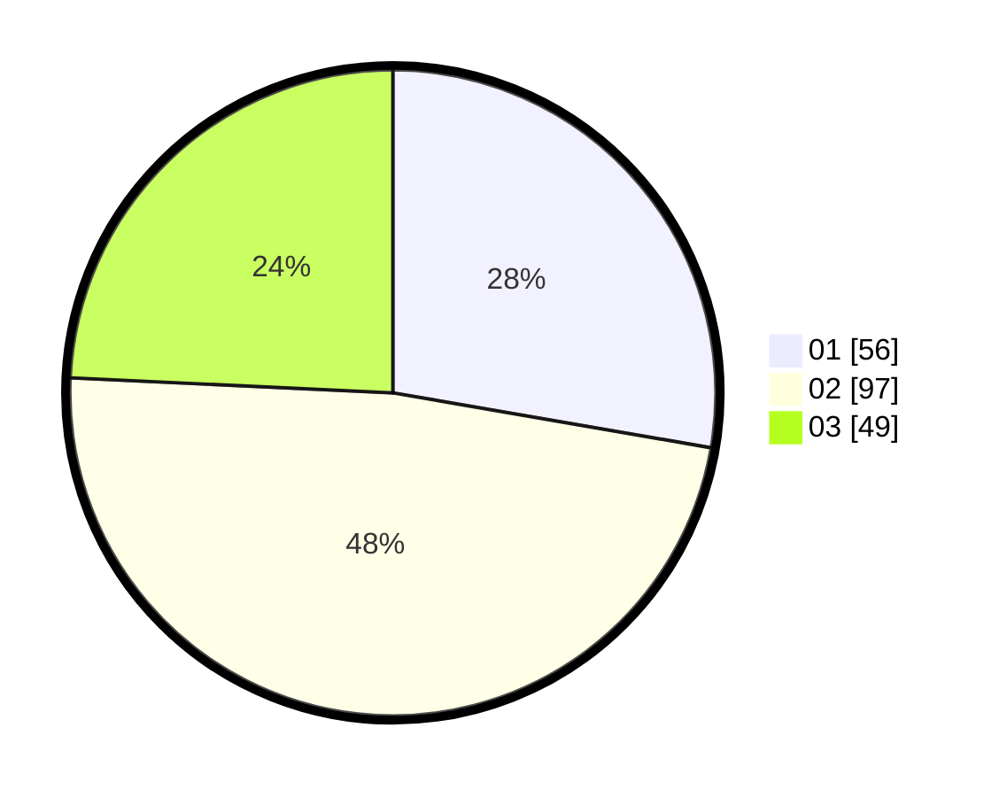

# Hasil

Hasil perolehan suara paslon dapat dilihat pada file paslon-01.txt, paslon-02.txt, dan paslon-03.txt.

Jika tidak ada, artinya data tersebut belum ada pada SIREKAP.

## Perolehan Suara

 * Paslon 01: **56**.
 * Paslon 02: **97**.
 * Paslon 03: **49**.

## Foto C Plano

https://sirekap-obj-formc.kpu.go.id/1625/pemilu/ppwp/31/73/01/10/04/3173011004097-20240214-195658--850046c4-5254-411f-a674-110c8ff5834b.jpg

https://sirekap-obj-formc.kpu.go.id/1625/pemilu/ppwp/31/73/01/10/04/3173011004097-20240216-131354--fd10d568-7119-4267-b114-5b41602c3d59.jpg

https://sirekap-obj-formc.kpu.go.id/1625/pemilu/ppwp/31/73/01/10/04/3173011004097-20240214-195940--a1d98d4f-4fbe-44ce-98e8-1f3eb2acc36c.jpg

## DATA PEMILIH TETAP

Jumlah pemilih dalam DPT: **291**.
 * L: **154**.
 * P: **137**.

## DATA PENGGUNA HAK PILIH

Jumlah pengguna hak pilih dalam DPT: **200**.
 * L: **104**.
 * P: **96**.

Jumlah pengguna hak pilih dalam DPTb: **0**.
 * L: **0**.
 * P: **0**.

Jumlah pengguna hak pilih dalam DPK: **5**.
 * L: **2**.
 * P: **3**.

Jumlah pengguna hak pilih: **205**.
 * L: **106**.
 * P: **99**.

## JUMLAH SUARA SAH DAN TIDAK SAH

JUMLAH SELURUH SUARA SAH: **202**.

JUMLAH SUARA TIDAK SAH: **3**.

JUMLAH SELURUH SUARA SAH DAN SUARA TIDAK SAH: **205**.
