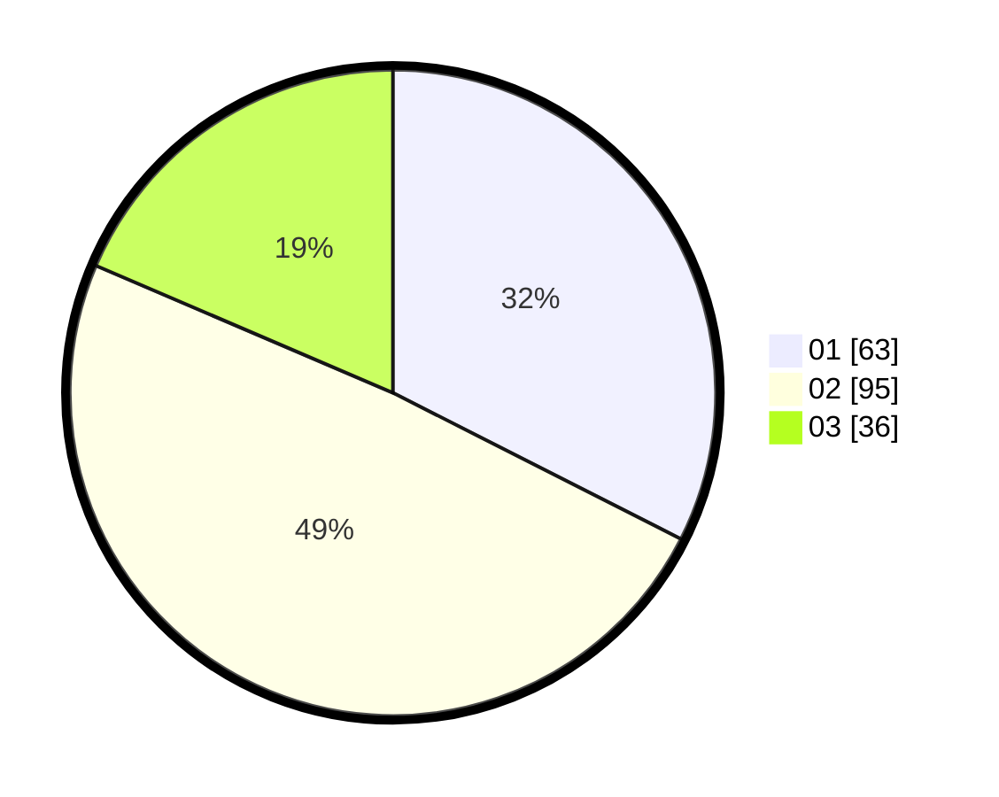

# Hasil

Hasil perolehan suara paslon dapat dilihat pada file paslon-01.txt, paslon-02.txt, dan paslon-03.txt.

Jika tidak ada, artinya data tersebut belum ada pada SIREKAP.

## Perolehan Suara

 * Paslon 01: **63**.
 * Paslon 02: **95**.
 * Paslon 03: **36**.

## Foto C Plano

https://sirekap-obj-formc.kpu.go.id/4b46/pemilu/ppwp/31/73/01/10/04/3173011004102-20240215-014251--ba84bd75-9085-4adb-a7a6-9be82769b8b4.jpg

https://sirekap-obj-formc.kpu.go.id/4b46/pemilu/ppwp/31/73/01/10/04/3173011004102-20240215-014508--b6ddbd69-5549-4f8e-98ac-535ab5d9d582.jpg

https://sirekap-obj-formc.kpu.go.id/4b46/pemilu/ppwp/31/73/01/10/04/3173011004102-20240215-014656--19aca2af-b00c-4c85-b9ff-3c12e5cf8b55.jpg
