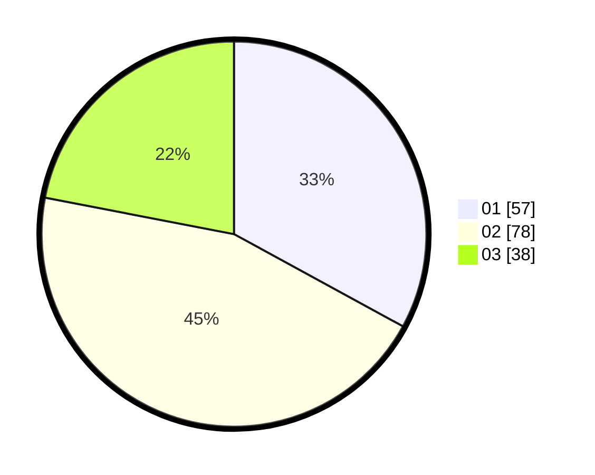

# Hasil

Hasil perolehan suara paslon dapat dilihat pada file paslon-01.txt, paslon-02.txt, dan paslon-03.txt.

Jika tidak ada, artinya data tersebut belum ada pada SIREKAP.

## Perolehan Suara

 * Paslon 01: **57**.
 * Paslon 02: **78**.
 * Paslon 03: **38**.

## Foto C Plano

https://sirekap-obj-formc.kpu.go.id/44a3/pemilu/ppwp/31/73/01/10/04/3173011004104-20240214-200355--5a70eeb4-11fc-4965-a554-9e6670aea0d9.jpg

https://sirekap-obj-formc.kpu.go.id/44a3/pemilu/ppwp/31/73/01/10/04/3173011004104-20240214-190629--a744e444-a958-4721-b2d7-9dea4d3ff60b.jpg

https://sirekap-obj-formc.kpu.go.id/44a3/pemilu/ppwp/31/73/01/10/04/3173011004104-20240214-190850--2a6c7246-2ecf-4c06-85ed-cb99ce95846e.jpg

## DATA PEMILIH TETAP

Jumlah pemilih dalam DPT: **271**.
 * L: **146**.
 * P: **125**.

## DATA PENGGUNA HAK PILIH

Jumlah pengguna hak pilih dalam DPT: **175**.
 * L: **93**.
 * P: **82**.

Jumlah pengguna hak pilih dalam DPTb: **0**.
 * L: **0**.
 * P: **0**.

Jumlah pengguna hak pilih dalam DPK: **0**.
 * L: **0**.
 * P: **0**.

Jumlah pengguna hak pilih: **175**.
 * L: **93**.
 * P: **82**.

## JUMLAH SUARA SAH DAN TIDAK SAH

JUMLAH SELURUH SUARA SAH: **173**.

JUMLAH SUARA TIDAK SAH: **2**.

JUMLAH SELURUH SUARA SAH DAN SUARA TIDAK SAH: **175**.
