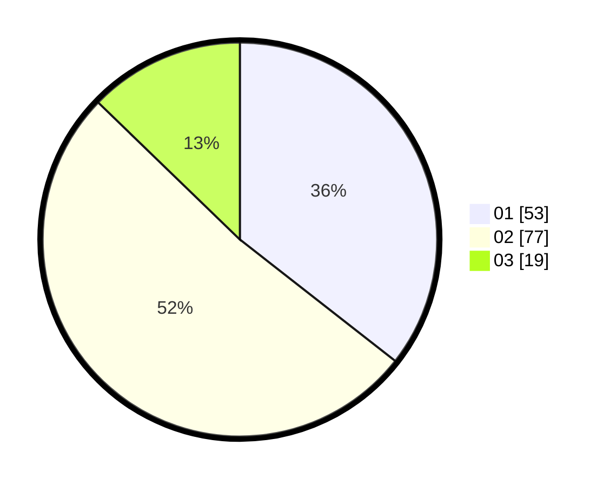

# Hasil

Hasil perolehan suara paslon dapat dilihat pada file paslon-01.txt, paslon-02.txt, dan paslon-03.txt.

Jika tidak ada, artinya data tersebut belum ada pada SIREKAP.

## Perolehan Suara

 * Paslon 01: **53**.
 * Paslon 02: **77**.
 * Paslon 03: **19**.

## Foto C Plano

https://sirekap-obj-formc.kpu.go.id/2fc4/pemilu/ppwp/31/73/01/10/04/3173011004106-20240215-181716--f15c9a75-6513-4d29-9e2a-3e889460c879.jpg

https://sirekap-obj-formc.kpu.go.id/2fc4/pemilu/ppwp/31/73/01/10/04/3173011004106-20240215-181738--031188a8-f2d1-4cba-90cd-76836d955eac.jpg

https://sirekap-obj-formc.kpu.go.id/2fc4/pemilu/ppwp/31/73/01/10/04/3173011004106-20240215-181727--2e3c4981-21ee-48e6-acf2-629172b46c15.jpg

## DATA PEMILIH TETAP

Jumlah pemilih dalam DPT: **214**.
 * L: **106**.
 * P: **108**.

## DATA PENGGUNA HAK PILIH

Jumlah pengguna hak pilih dalam DPT: **150**.
 * L: **73**.
 * P: **77**.

Jumlah pengguna hak pilih dalam DPTb: **0**.
 * L: **0**.
 * P: **0**.

Jumlah pengguna hak pilih dalam DPK: **0**.
 * L: **0**.
 * P: **0**.

Jumlah pengguna hak pilih: **150**.
 * L: **73**.
 * P: **77**.

## JUMLAH SUARA SAH DAN TIDAK SAH

JUMLAH SELURUH SUARA SAH: **149**.

JUMLAH SUARA TIDAK SAH: **1**.

JUMLAH SELURUH SUARA SAH DAN SUARA TIDAK SAH: **150**.
