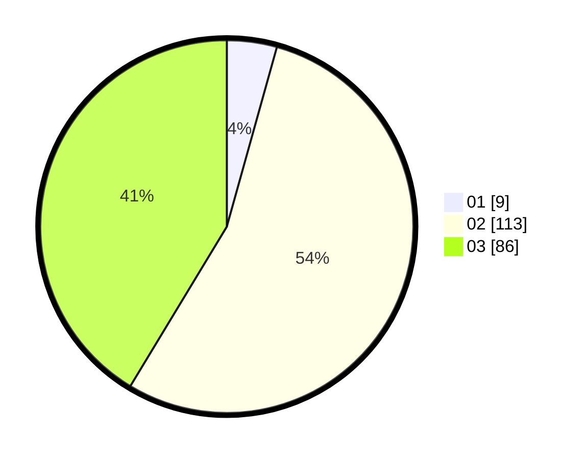

# Hasil

Hasil perolehan suara paslon dapat dilihat pada file paslon-01.txt, paslon-02.txt, dan paslon-03.txt.

Jika tidak ada, artinya data tersebut belum ada pada SIREKAP.

## Perolehan Suara

 * Paslon 01: **9**.
 * Paslon 02: **113**.
 * Paslon 03: **86**.

## Foto C Plano

https://sirekap-obj-formc.kpu.go.id/96a4/pemilu/ppwp/31/73/01/10/04/3173011004107-20240215-144049--cc42a5f3-2bbd-4ffa-86b7-dc50941f8ffa.jpg

https://sirekap-obj-formc.kpu.go.id/96a4/pemilu/ppwp/31/73/01/10/04/3173011004107-20240215-162233--c7e73ae3-78a6-42ea-893c-e55081fbc867.jpg

https://sirekap-obj-formc.kpu.go.id/96a4/pemilu/ppwp/31/73/01/10/04/3173011004107-20240215-144315--a7bde14e-47f5-43db-ba95-90184c7440ac.jpg

## DATA PEMILIH TETAP

Jumlah pemilih dalam DPT: **241**.
 * L: **111**.
 * P: **130**.

## DATA PENGGUNA HAK PILIH

Jumlah pengguna hak pilih dalam DPT: **188**.
 * L: **88**.
 * P: **100**.

Jumlah pengguna hak pilih dalam DPTb: **15**.
 * L: **7**.
 * P: **8**.

Jumlah pengguna hak pilih dalam DPK: **8**.
 * L: **5**.
 * P: **3**.

Jumlah pengguna hak pilih: **211**.
 * L: **100**.
 * P: **111**.

## JUMLAH SUARA SAH DAN TIDAK SAH

JUMLAH SELURUH SUARA SAH: **208**.

JUMLAH SUARA TIDAK SAH: **3**.

JUMLAH SELURUH SUARA SAH DAN SUARA TIDAK SAH: **211**.
