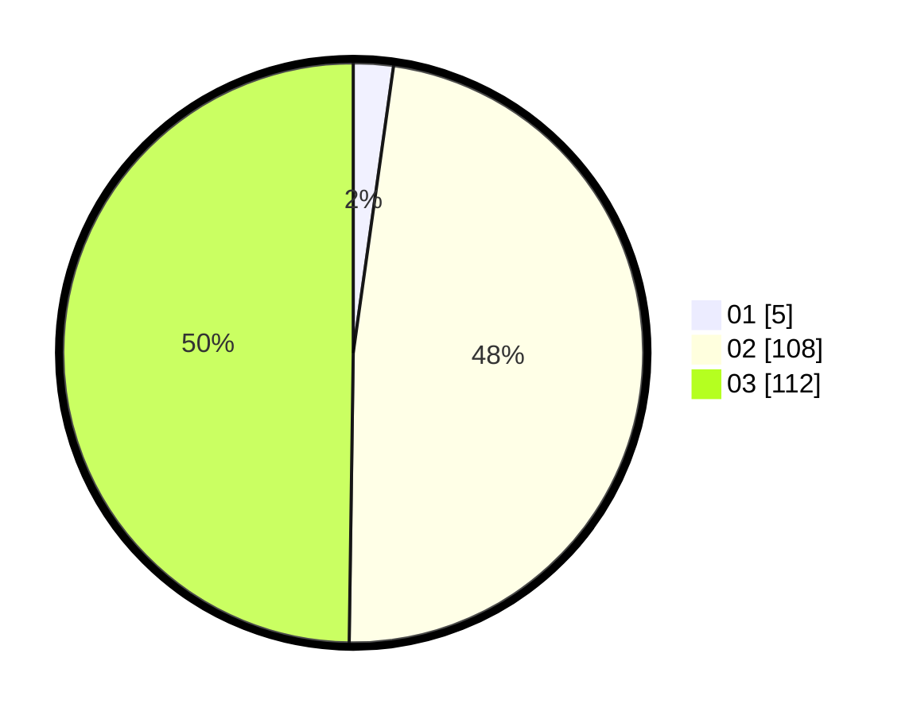

# Hasil

Hasil perolehan suara paslon dapat dilihat pada file paslon-01.txt, paslon-02.txt, dan paslon-03.txt.

Jika tidak ada, artinya data tersebut belum ada pada SIREKAP.

## Perolehan Suara

 * Paslon 01: **5**.
 * Paslon 02: **108**.
 * Paslon 03: **112**.

## Foto C Plano

https://sirekap-obj-formc.kpu.go.id/5c71/pemilu/ppwp/31/73/01/10/04/3173011004108-20240214-230658--4e66570a-4dd9-42a2-8dd3-8118f21c024d.jpg

https://sirekap-obj-formc.kpu.go.id/5c71/pemilu/ppwp/31/73/01/10/04/3173011004108-20240214-230607--d6589781-367d-4736-9174-254d7d1ffaa7.jpg

https://sirekap-obj-formc.kpu.go.id/5c71/pemilu/ppwp/31/73/01/10/04/3173011004108-20240214-230753--91c7f595-976c-4ad6-979f-cb7e614a0d33.jpg
