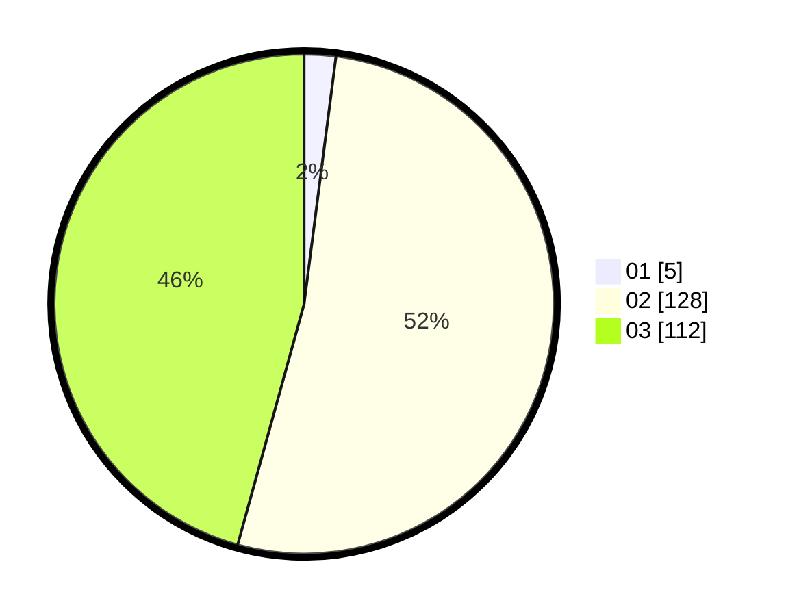

# Hasil

Hasil perolehan suara paslon dapat dilihat pada file paslon-01.txt, paslon-02.txt, dan paslon-03.txt.

Jika tidak ada, artinya data tersebut belum ada pada SIREKAP.

## Perolehan Suara

 * Paslon 01: **5**.
 * Paslon 02: **128**.
 * Paslon 03: **112**.

## Foto C Plano

https://sirekap-obj-formc.kpu.go.id/a89c/pemilu/ppwp/31/73/01/10/04/3173011004109-20240214-213257--c926e40f-4e9c-4018-8bf1-56a4f3267662.jpg

https://sirekap-obj-formc.kpu.go.id/a89c/pemilu/ppwp/31/73/01/10/04/3173011004109-20240214-213333--69e7434c-a168-4d11-8870-a3056a0cac5f.jpg

https://sirekap-obj-formc.kpu.go.id/a89c/pemilu/ppwp/31/73/01/10/04/3173011004109-20240214-213418--23dd40b2-ca93-4201-b70f-34581a56fb72.jpg

## DATA PEMILIH TETAP

Jumlah pemilih dalam DPT: **291**.
 * L: **138**.
 * P: **153**.

## DATA PENGGUNA HAK PILIH

Jumlah pengguna hak pilih dalam DPT: **227**.
 * L: **114**.
 * P: **113**.

Jumlah pengguna hak pilih dalam DPTb: **13**.
 * L: **5**.
 * P: **8**.

Jumlah pengguna hak pilih dalam DPK: **7**.
 * L: **2**.
 * P: **5**.

Jumlah pengguna hak pilih: **247**.
 * L: **121**.
 * P: **126**.

## JUMLAH SUARA SAH DAN TIDAK SAH

JUMLAH SELURUH SUARA SAH: **245**.

JUMLAH SUARA TIDAK SAH: **2**.

JUMLAH SELURUH SUARA SAH DAN SUARA TIDAK SAH: **247**.
