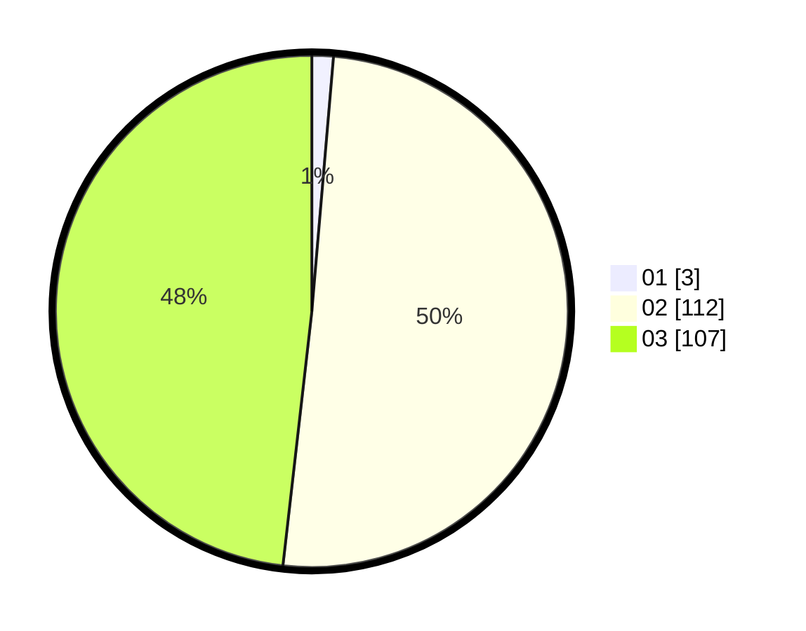

# Hasil

Hasil perolehan suara paslon dapat dilihat pada file paslon-01.txt, paslon-02.txt, dan paslon-03.txt.

Jika tidak ada, artinya data tersebut belum ada pada SIREKAP.

## Perolehan Suara

 * Paslon 01: **3**.
 * Paslon 02: **112**.
 * Paslon 03: **107**.

## Foto C Plano

https://sirekap-obj-formc.kpu.go.id/22d4/pemilu/ppwp/31/73/01/10/04/3173011004110-20240214-184840--e7b6cbdc-1101-4801-80bf-e18d16144a64.jpg

https://sirekap-obj-formc.kpu.go.id/22d4/pemilu/ppwp/31/73/01/10/04/3173011004110-20240214-184847--d445611b-ae3a-4f36-b77c-4dd16f264c19.jpg

https://sirekap-obj-formc.kpu.go.id/22d4/pemilu/ppwp/31/73/01/10/04/3173011004110-20240214-184850--4c143f6d-059d-4736-92c3-f674e677dd12.jpg

## DATA PEMILIH TETAP

Jumlah pemilih dalam DPT: **271**.
 * L: **135**.
 * P: **136**.

## DATA PENGGUNA HAK PILIH

Jumlah pengguna hak pilih dalam DPT: **198**.
 * L: **100**.
 * P: **98**.

Jumlah pengguna hak pilih dalam DPTb: **13**.
 * L: **5**.
 * P: **8**.

Jumlah pengguna hak pilih dalam DPK: **13**.
 * L: **7**.
 * P: **6**.

Jumlah pengguna hak pilih: **224**.
 * L: **112**.
 * P: **112**.

## JUMLAH SUARA SAH DAN TIDAK SAH

JUMLAH SELURUH SUARA SAH: **222**.

JUMLAH SUARA TIDAK SAH: **2**.

JUMLAH SELURUH SUARA SAH DAN SUARA TIDAK SAH: **224**.
