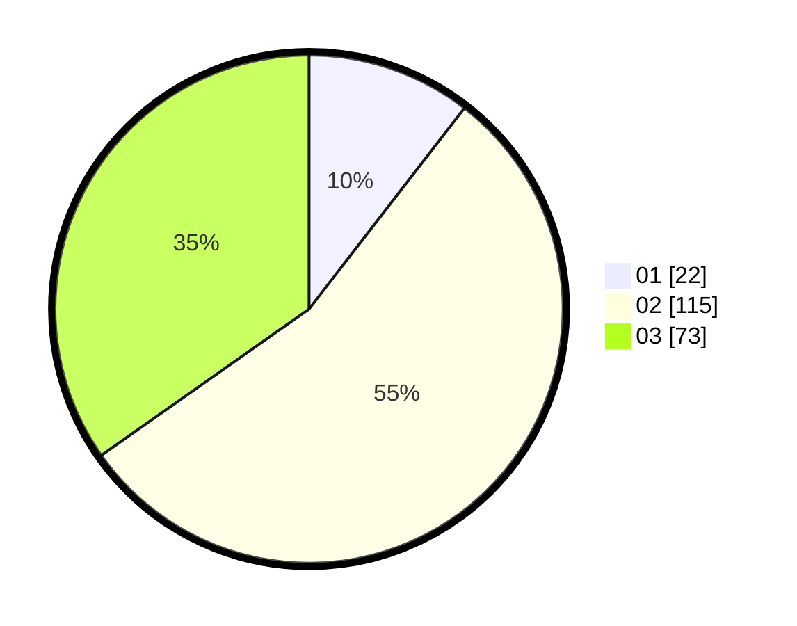

# Hasil

Hasil perolehan suara paslon dapat dilihat pada file paslon-01.txt, paslon-02.txt, dan paslon-03.txt.

Jika tidak ada, artinya data tersebut belum ada pada SIREKAP.

## Perolehan Suara

 * Paslon 01: **22**.
 * Paslon 02: **115**.
 * Paslon 03: **73**.

## Foto C Plano

https://sirekap-obj-formc.kpu.go.id/f4d6/pemilu/ppwp/31/73/01/10/05/3173011005002-20240216-010838--5bf51958-14b6-4951-8583-7c8e9c3741bd.jpg

https://sirekap-obj-formc.kpu.go.id/f4d6/pemilu/ppwp/31/73/01/10/05/3173011005002-20240216-010840--84d698b2-1bcd-443d-b295-6f41332ad933.jpg

https://sirekap-obj-formc.kpu.go.id/f4d6/pemilu/ppwp/31/73/01/10/05/3173011005002-20240216-010839--5848dbfc-e956-4a6e-ad56-ec5c6e032e14.jpg

## DATA PEMILIH TETAP

Jumlah pemilih dalam DPT: **289**.
 * L: **148**.
 * P: **141**.

## DATA PENGGUNA HAK PILIH

Jumlah pengguna hak pilih dalam DPT: **213**.
 * L: **107**.
 * P: **106**.

Jumlah pengguna hak pilih dalam DPTb: **0**.
 * L: **0**.
 * P: **0**.

Jumlah pengguna hak pilih dalam DPK: **0**.
 * L: **0**.
 * P: **0**.

Jumlah pengguna hak pilih: **213**.
 * L: **107**.
 * P: **106**.

## JUMLAH SUARA SAH DAN TIDAK SAH

JUMLAH SELURUH SUARA SAH: **210**.

JUMLAH SUARA TIDAK SAH: **3**.

JUMLAH SELURUH SUARA SAH DAN SUARA TIDAK SAH: **213**.
