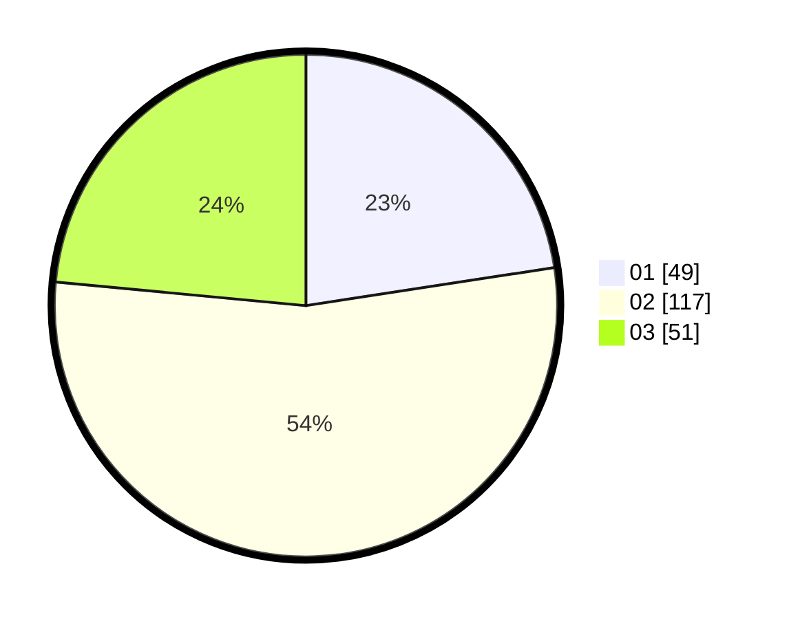

# Hasil

Hasil perolehan suara paslon dapat dilihat pada file paslon-01.txt, paslon-02.txt, dan paslon-03.txt.

Jika tidak ada, artinya data tersebut belum ada pada SIREKAP.

## Perolehan Suara

 * Paslon 01: **49**.
 * Paslon 02: **117**.
 * Paslon 03: **51**.

## Foto C Plano

https://sirekap-obj-formc.kpu.go.id/f627/pemilu/ppwp/31/73/01/10/05/3173011005004-20240214-201027--424ea3fe-2c3c-46ca-9810-ed0f33d4bfea.jpg

https://sirekap-obj-formc.kpu.go.id/f627/pemilu/ppwp/31/73/01/10/05/3173011005004-20240214-201220--53b5da20-518a-4dde-9e51-e6a2550a4198.jpg

https://sirekap-obj-formc.kpu.go.id/f627/pemilu/ppwp/31/73/01/10/05/3173011005004-20240214-155829--676302de-4b6b-43e8-800c-0fa36899cdac.jpg

## DATA PEMILIH TETAP

Jumlah pemilih dalam DPT: **291**.
 * L: **155**.
 * P: **136**.

## DATA PENGGUNA HAK PILIH

Jumlah pengguna hak pilih dalam DPT: **219**.
 * L: **113**.
 * P: **106**.

Jumlah pengguna hak pilih dalam DPTb: **0**.
 * L: **0**.
 * P: **0**.

Jumlah pengguna hak pilih dalam DPK: **1**.
 * L: **0**.
 * P: **1**.

Jumlah pengguna hak pilih: **220**.
 * L: **113**.
 * P: **107**.

## JUMLAH SUARA SAH DAN TIDAK SAH

JUMLAH SELURUH SUARA SAH: **217**.

JUMLAH SUARA TIDAK SAH: **3**.

JUMLAH SELURUH SUARA SAH DAN SUARA TIDAK SAH: **220**.
