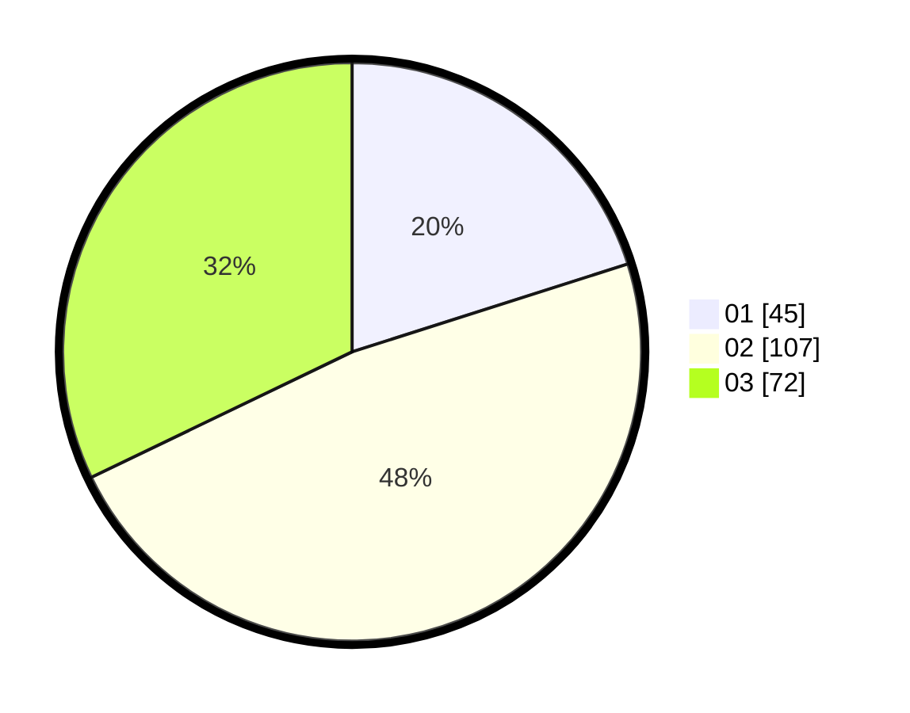

# Hasil

Hasil perolehan suara paslon dapat dilihat pada file paslon-01.txt, paslon-02.txt, dan paslon-03.txt.

Jika tidak ada, artinya data tersebut belum ada pada SIREKAP.

## Perolehan Suara

 * Paslon 01: **45**.
 * Paslon 02: **107**.
 * Paslon 03: **72**.

## Foto C Plano

https://sirekap-obj-formc.kpu.go.id/3b8e/pemilu/ppwp/31/73/01/10/05/3173011005005-20240216-122112--8ee1e39f-93dd-4695-ad52-faeb55424a3e.jpg

https://sirekap-obj-formc.kpu.go.id/3b8e/pemilu/ppwp/31/73/01/10/05/3173011005005-20240215-011914--dfb31582-573c-43ea-9be2-6ad611b26878.jpg

https://sirekap-obj-formc.kpu.go.id/3b8e/pemilu/ppwp/31/73/01/10/05/3173011005005-20240215-013729--4ddcac07-59b8-48df-be20-8e55d16a16df.jpg

## DATA PEMILIH TETAP

Jumlah pemilih dalam DPT: **290**.
 * L: **153**.
 * P: **137**.

## DATA PENGGUNA HAK PILIH

Jumlah pengguna hak pilih dalam DPT: **219**.
 * L: **120**.
 * P: **99**.

Jumlah pengguna hak pilih dalam DPTb: **0**.
 * L: **0**.
 * P: **0**.

Jumlah pengguna hak pilih dalam DPK: **8**.
 * L: **5**.
 * P: **3**.

Jumlah pengguna hak pilih: **227**.
 * L: **125**.
 * P: **102**.

## JUMLAH SUARA SAH DAN TIDAK SAH

JUMLAH SELURUH SUARA SAH: **224**.

JUMLAH SUARA TIDAK SAH: **3**.

JUMLAH SELURUH SUARA SAH DAN SUARA TIDAK SAH: **227**.
