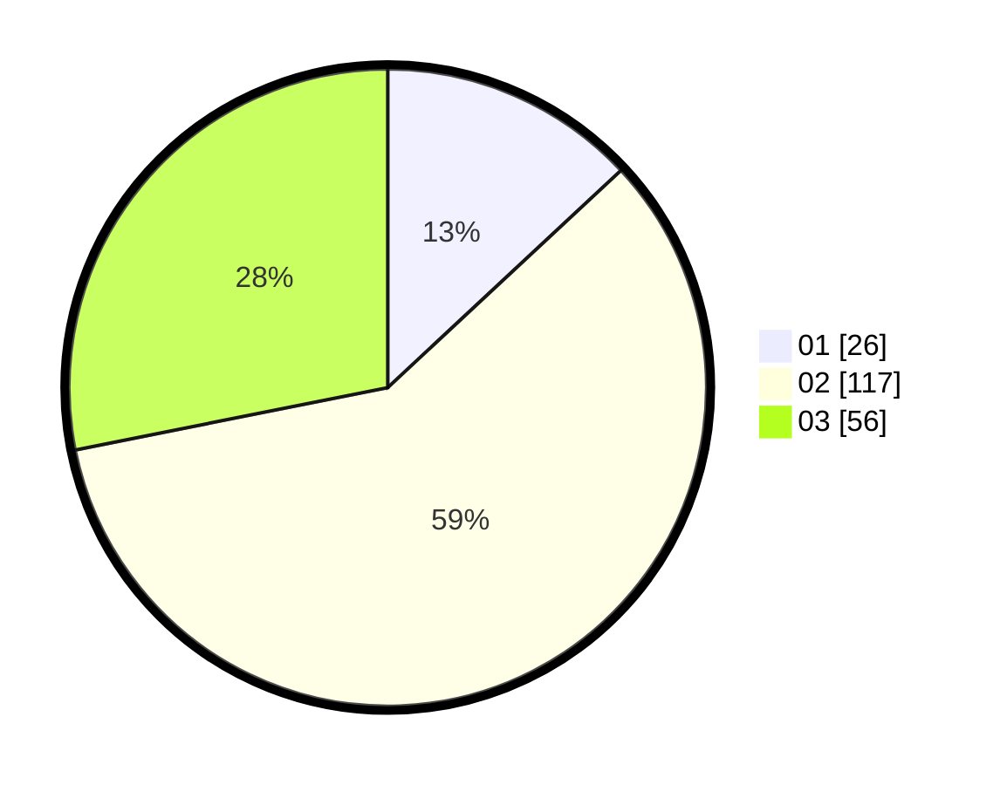

# Hasil

Hasil perolehan suara paslon dapat dilihat pada file paslon-01.txt, paslon-02.txt, dan paslon-03.txt.

Jika tidak ada, artinya data tersebut belum ada pada SIREKAP.

## Perolehan Suara

 * Paslon 01: **26**.
 * Paslon 02: **117**.
 * Paslon 03: **56**.

## Foto C Plano

https://sirekap-obj-formc.kpu.go.id/b146/pemilu/ppwp/31/73/01/10/05/3173011005006-20240216-000122--88958df7-2867-4c15-8653-524da73e776f.jpg

https://sirekap-obj-formc.kpu.go.id/b146/pemilu/ppwp/31/73/01/10/05/3173011005006-20240214-155740--258e7f77-de33-4498-813f-c853b6886eaf.jpg

https://sirekap-obj-formc.kpu.go.id/b146/pemilu/ppwp/31/73/01/10/05/3173011005006-20240214-160057--e8780542-aae3-4c9a-8a84-7af36d52d58e.jpg

## DATA PEMILIH TETAP

Jumlah pemilih dalam DPT: **194**.
 * L: **86**.
 * P: **108**.

## DATA PENGGUNA HAK PILIH

Jumlah pengguna hak pilih dalam DPT: **194**.
 * L: **86**.
 * P: **108**.

Jumlah pengguna hak pilih dalam DPTb: **0**.
 * L: **0**.
 * P: **0**.

Jumlah pengguna hak pilih dalam DPK: **6**.
 * L: **2**.
 * P: **4**.

Jumlah pengguna hak pilih: **200**.
 * L: **88**.
 * P: **112**.

## JUMLAH SUARA SAH DAN TIDAK SAH

JUMLAH SELURUH SUARA SAH: **199**.

JUMLAH SUARA TIDAK SAH: **1**.

JUMLAH SELURUH SUARA SAH DAN SUARA TIDAK SAH: **200**.
