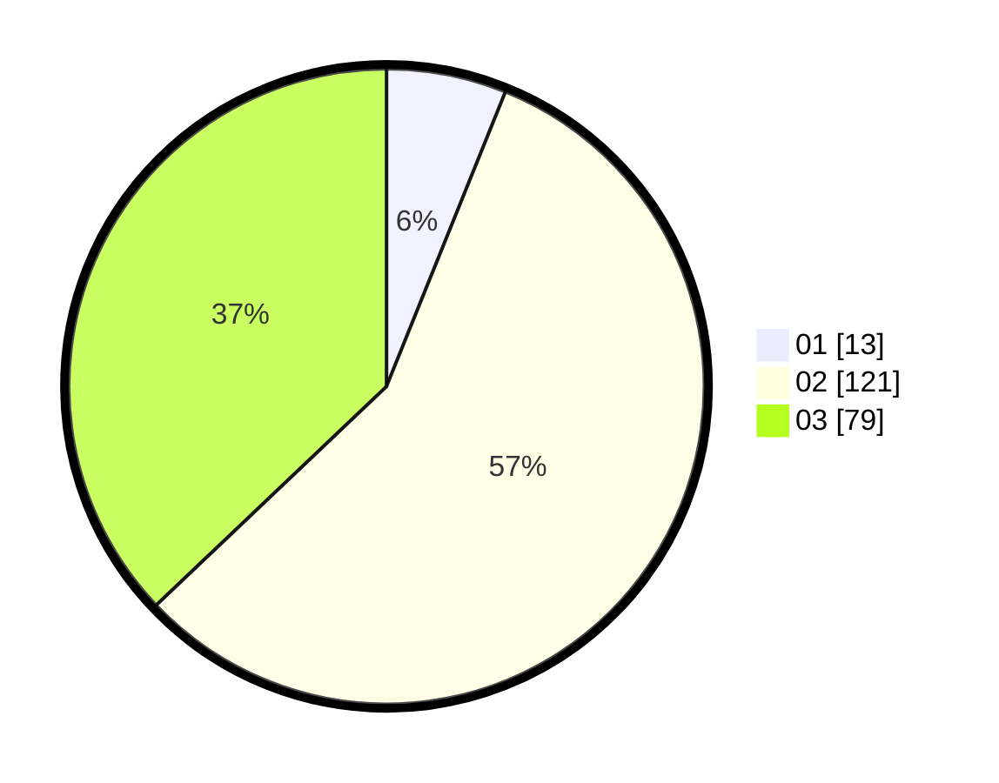

# Hasil

Hasil perolehan suara paslon dapat dilihat pada file paslon-01.txt, paslon-02.txt, dan paslon-03.txt.

Jika tidak ada, artinya data tersebut belum ada pada SIREKAP.

## Perolehan Suara

 * Paslon 01: **13**.
 * Paslon 02: **121**.
 * Paslon 03: **79**.

## Foto C Plano

https://sirekap-obj-formc.kpu.go.id/2373/pemilu/ppwp/31/73/01/10/05/3173011005007-20240217-092250--207c5d50-f812-411d-aa7d-3ce81cb5ccdc.jpg

https://sirekap-obj-formc.kpu.go.id/2373/pemilu/ppwp/31/73/01/10/05/3173011005007-20240217-092252--9f512978-d024-470b-a123-db4866af7c94.jpg

https://sirekap-obj-formc.kpu.go.id/2373/pemilu/ppwp/31/73/01/10/05/3173011005007-20240217-092251--a1e9e968-4fec-4b24-92e3-92ffaee1c542.jpg

## DATA PEMILIH TETAP

Jumlah pemilih dalam DPT: **214**.
 * L: **103**.
 * P: **111**.

## DATA PENGGUNA HAK PILIH

Jumlah pengguna hak pilih dalam DPT: **283**.
 * L: **135**.
 * P: **148**.

Jumlah pengguna hak pilih dalam DPTb: **0**.
 * L: **0**.
 * P: **0**.

Jumlah pengguna hak pilih dalam DPK: **2**.
 * L: **2**.
 * P: **0**.

Jumlah pengguna hak pilih: **285**.
 * L: **137**.
 * P: **148**.

## JUMLAH SUARA SAH DAN TIDAK SAH

JUMLAH SELURUH SUARA SAH: **213**.

JUMLAH SUARA TIDAK SAH: **1**.

JUMLAH SELURUH SUARA SAH DAN SUARA TIDAK SAH: **214**.
