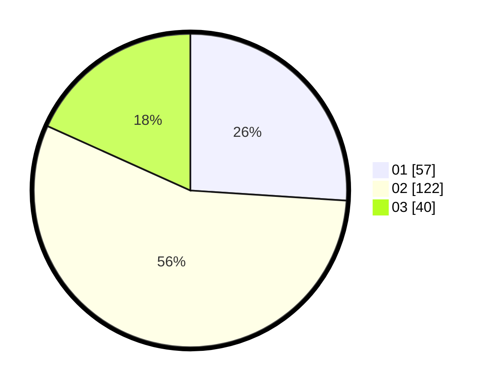

# Hasil

Hasil perolehan suara paslon dapat dilihat pada file paslon-01.txt, paslon-02.txt, dan paslon-03.txt.

Jika tidak ada, artinya data tersebut belum ada pada SIREKAP.

## Perolehan Suara

 * Paslon 01: **57**.
 * Paslon 02: **122**.
 * Paslon 03: **40**.

## Foto C Plano

https://sirekap-obj-formc.kpu.go.id/9bdb/pemilu/ppwp/31/73/01/10/05/3173011005009-20240215-224419--6d5a3175-1526-4c4f-9323-7a18aeb23fdf.jpg

https://sirekap-obj-formc.kpu.go.id/9bdb/pemilu/ppwp/31/73/01/10/05/3173011005009-20240215-224423--ce406198-90c3-4218-8cd6-26ba4c4fd089.jpg

https://sirekap-obj-formc.kpu.go.id/9bdb/pemilu/ppwp/31/73/01/10/05/3173011005009-20240215-224420--254beccd-9130-4db5-8f0c-7b6c7e669226.jpg

## DATA PEMILIH TETAP

Jumlah pemilih dalam DPT: **286**.
 * L: **149**.
 * P: **137**.

## DATA PENGGUNA HAK PILIH

Jumlah pengguna hak pilih dalam DPT: **222**.
 * L: **117**.
 * P: **105**.

Jumlah pengguna hak pilih dalam DPTb: **0**.
 * L: **0**.
 * P: **0**.

Jumlah pengguna hak pilih dalam DPK: **0**.
 * L: **0**.
 * P: **0**.

Jumlah pengguna hak pilih: **222**.
 * L: **117**.
 * P: **105**.

## JUMLAH SUARA SAH DAN TIDAK SAH

JUMLAH SELURUH SUARA SAH: **219**.

JUMLAH SUARA TIDAK SAH: **3**.

JUMLAH SELURUH SUARA SAH DAN SUARA TIDAK SAH: **222**.
